# Analysis of LinkedIn Profiles to Create a Career Success Playbook

The goal of this project is to analyze the career paths of multiple top professionals (e.g., CTOs, Marketing Heads, Lead Data Scientists, Lead Software Engineers, Product Managers, etc.) and build a career success playbook. This playbook could potentially act as a guide to help people be more job-ready or move up the corporate ladder by taking inspiration from the paths of professionals who have already reached the top of the ladder.<br><br>
Having the right skillset increases the “job readiness” of the candidates and reduces the investment an employer needs to make in re-training their hirees. Employers have reported that there is a steadily widening “skills gap” that is hurting workers, businesses, and the economy.[1] There are also reports explaining how skill-based hiring has been increasing over the past few years.[2] So, having the right skills to focus on for a dream job has become even more important. We envision that the playbook will be helpful for current students, early career professionals, people looking for work after a resume gap, and professionals looking to switch careers by obtaining the right skill sets needed for their career goals.
<br><br>
[1] https://www.businessroundtable.org/policy-perspectives/building-americas-tomorrow-ready-workforce/closing-the-skills-gap/the-skills-gap-explained
<br>
[2] https://hbr.org/2022/02/skills-based-hiring-is-on-the-rise

## Statement of Scope

This project is aimed at finding the career paths that stalwarts of their fields have followed. This will help readers be more task oriented about the career path they choose to follow. 

We plan to look for 3 different careers:
- Data Scientist
- Chief Technology Officer (CTO)
- Principal Consultant

We plan to get the following data points from mentioned successful individuals:
- Level of education (High school, Bachelors, Masters or PhD)
- Type of education (MBA or MS, Engineering or Hospitality, Technology or Biology)
- Total experience
- Designations worked on (business analyst, software engineer, senior software engineer, etc.)
- Skill set possessed

We then intend to analyze the following data points to obtain the career paths they have followed:
- Average experience in each company (will help our readers know the ideal time to switch companies)
- Most popular education by career path
- The most popular skills by career path

The entire analysis will be performed in Python

### Deliverables:

**Deliverable 1** : Code for data collection, cleaning, and transformation along with the data

**Deliverable 2** : Code for data analysis, visualizations, final codes, recommendations and conclusion

## Project Schedule

<b>Latest Timeline can be accessed [here](https://ostatemailokstate-my.sharepoint.com/:x:/g/personal/frankle_muchahary_okstate_edu/Ef3mrzskz0dKpTYlkwk5pbABStkzqWkWmAJBvBvxiZKOnQ?e=D2QEQ9)</b>

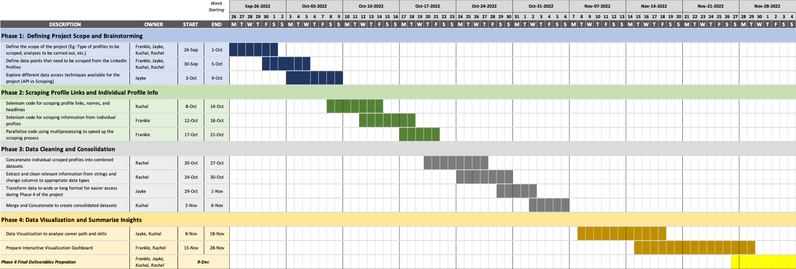

## Data Preparation

The data preparation process of this project involves searching for profiles on `LinkedIn` for three types of positions using multiple keywords, extracting profile links of multiple professionals in these fields, scraping information from individual profiles, and cleaning/consolidating data. These careers/positions are Chief Technology Officer, Principal Data Scientists, and Management Consultants. We carried out the scraping process in a two-step process where we first fetched the links, followed by detailed information from each profile, further detailed below. `Selenium` has been used as the key tool for scraping and `multiprocessing` has been used to aid in speeding up the process. Further, we have cleaned and transformed the scraped data using `regex`, `pandas`, and `dateutil`. At the end of the entire process, this scraped data has been saved as three different files, each containing three different sets of information, i.e `eduation information`, `experience information`, and `skills information`. We did not merge these three datasets into one single consolidated master file as a part of our data preparation step because they contain different sets of information that will mostly be analyzed individually (or could be merged if or when required for our analysis). Additionally, all three are at different levels of granularity, which will be detailed below. The key used to tie all three datasets together is `profile_id_dummy`. Further information on all the steps of our data preparation process has been detailed below.

**Final Datasets**
- [all_education_info.csv](data/final_cleaned_files/all_education_info.csv): Education Data for all profiles
- [all_name_and_experience_info.csv](data/final_cleaned_files/all_name_and_experience_info.csv): Professional Experience Data for all profiles
- [all_skills_info.csv](data/final_cleaned_files/all_skills_info.csv): List of skills listed in each profile

**Code Files**
- [get_profile_links.py](code/get_profile_links.py): Code for scraping profile links from LinkedIn for each profile type
- [clean_scraped_data_part0.py](code/clean_scraped_data_part0.py): Code for cleaning up the profile links fetched and adding dummy profile ids
- [scrape_individual_profiles.py](code/scrape_individual_profiles.py): Code for fetching information from individual profiles
- [clean_scraped_data_part1.py](code/clean_scraped_data_part1.py): Code for cleaning up all the information fetched from each LinkedIn profile
- [concatenating_and_merging.py](code/concatenating_and_merging.py): Code for final consolidation of all files to create 3 base files

### Data Access

First, we started with setting some parameters around the profiles we needed to search for, the number of profiles to be scraped, and the output file name. Here, `SEARCH_TERM` is the search term we will be entering into the LinkedIn search bar for getting a list of profiles. Each LinkedIn search results page shows 10 profiles. The parameter `NUM_PAGES_TO_FETCH_FOR_PROFILES` specifies how many pages we need to scrape for. <br /><br />

<pre>
    SEARCH_TERM = "Data Scientist"
    PROFILE_CSV_FILENAME = 'data/DataScienceProfiles.csv'
    NUM_PAGES_TO_FETCH_FOR_PROFILES = 20
</pre>
    
The data was scraped from LinkedIn where a list of profiles for each field were first scraped, followed by a process where we scraped information from individual profiles. The data access step includes broadly two steps:
1.	First, we extracted the profile URLs for 211 CTOs, 329 Data Scientists and 331 Consultants. There are some garbage values here (more on that in later sections)
2.	In the second step, all the profile URLs were opened individually and the information about the experience, education and skillsets was scraped
Looking each step individually in detail

#### Step 1:
We used `Selenium` as a main tool to help us scrape information from LinkedIn. The key steps we followed to achieve this have been mentioned below. The code that helped get inside LinkedIn is as follows:
```Python
### Open Chrome Driver
driver = webdriver.Chrome(service=Service(ChromeDriverManager().install()))

### Go to linkedin URL
driver.get("https://linkedin.com")

### Enter Username and Password and Click on Login
input_elements = driver.find_elements(
    By.XPATH,
    "//input[contains(@class, 'input__input' )][1]"
)
input_elements[0].send_keys(email)
input_elements[1].send_keys(password)
submit_button = driver.find_elements(
    By.XPATH,
    "//button[contains(@class, 'sign-in-form__submit-button')]"
)
submit_button[0].click()
```

Next, we searched for our desired term, Data Scientist in our case, and clicked the search button. The search page with Data Scientists opened up. We clicked 'See all people results' and the full page containing 10 data science profiles opened, like in the screenshot below.

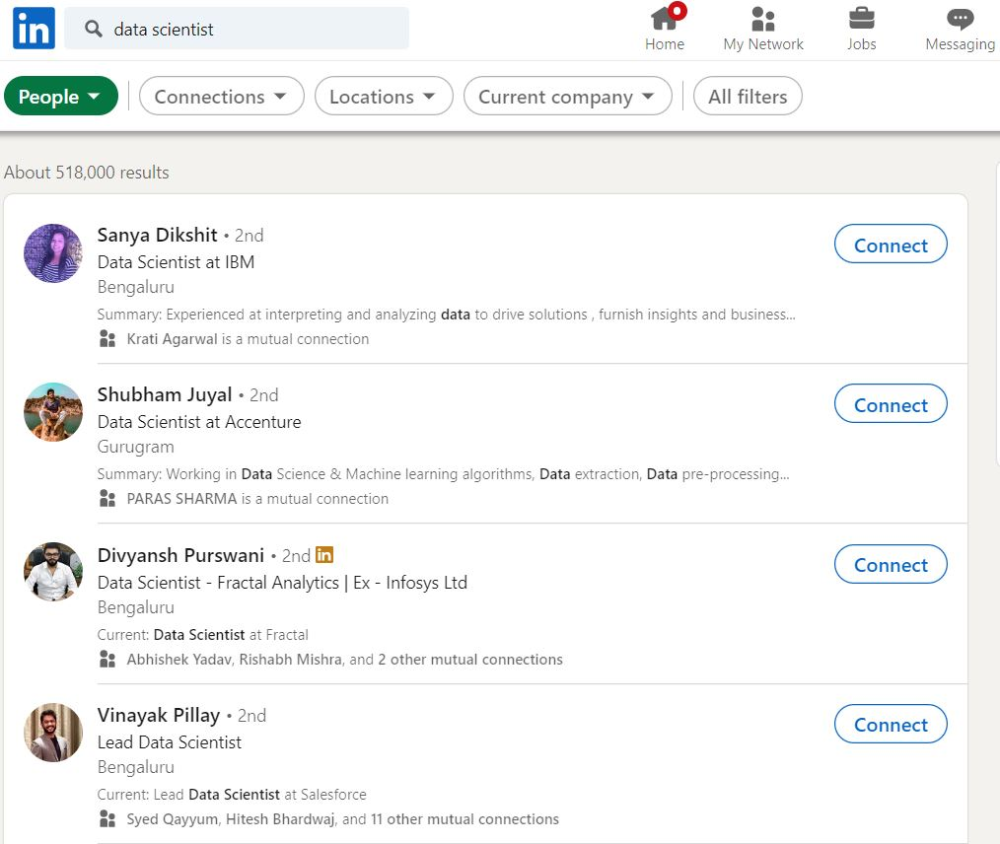

<br>Each name has a clickable URL, hence we scraped that URL along with their names and headings (like Chief Executive Officer at The Intraday Expert for the first one). <br>
We repeated the same process for multiple pages. The number of pages to be scraped was parameterized as NUM_PAGES_TO_FETCH_FOR_PROFILES. All the names, URLs and headings are saved in the CSV, parameterized as PROFILE_CSV_FILENAME.
In total, there were six of such CSVs created, as listed below:
- CEOProfiles.csv
- CTOProfiles.csv
- ConsultantProfiles-V1.csv
- ConsultantProfiles-V2.csv
- ConsultantProfiles-V3.csv
- DataScienceProfiles.csv


Each CSV looks like something along these lines:

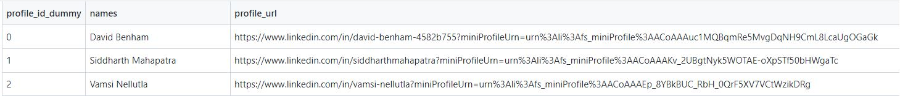

#### Step 2
Next, we started off by creating a primary key against each profile to act as a unique identifier. 
As we now have the profile URLs, extracting other information from the profile pages becomes much easier. We extracted the following information attributes from each profile:

**Experience:** 
- Company Name
- Titles (Positions held / holding)
- Service Duration

**Education:**
- Education Institute
- Degree (duration is a part of this field, which will be cleaned in the later stages)

**Skills:**
- Skill in the form of Python list eg [‘Python’, ‘R’, ‘SQL’]

In order to not lose progress while scraping the profiles, we saved every individual profile and the attributes in an individual CSV. For example, for primary key 0, we have 3 files like: 
- `0_education.csv`
- `0_experience.csv`
- `0_skills.csv`

Since there are a lot of profiles to scrape for, we used `multiprocessing` to scrape profiles in parallel by creating multiple instances of selenium.

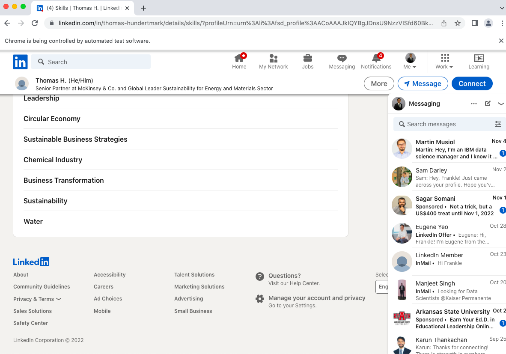
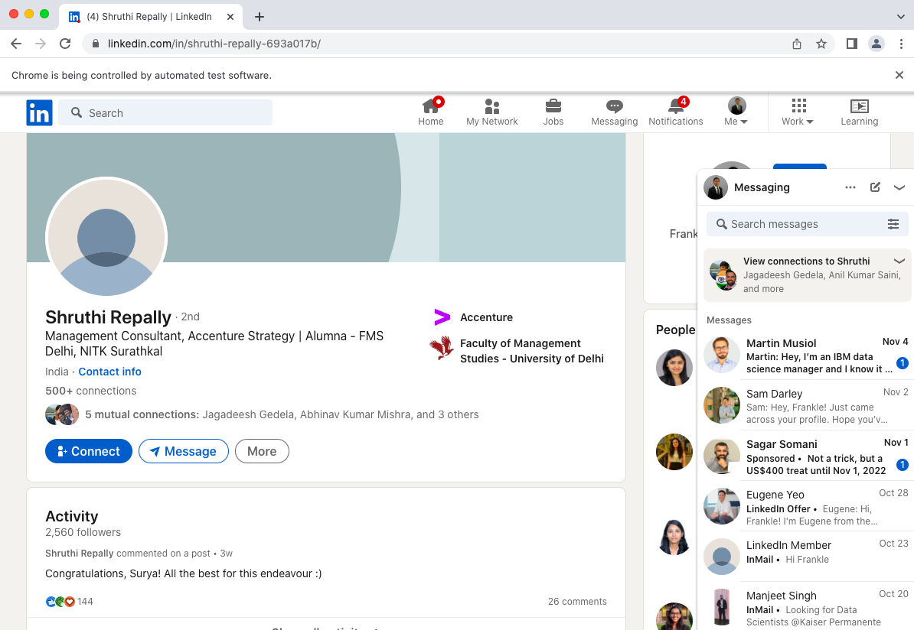
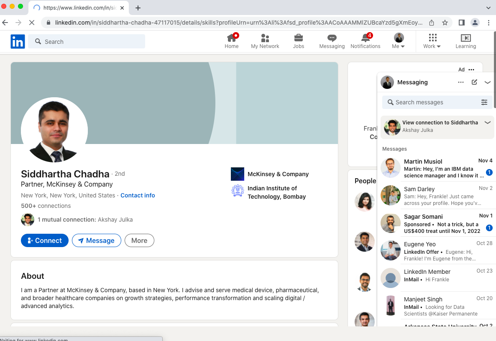
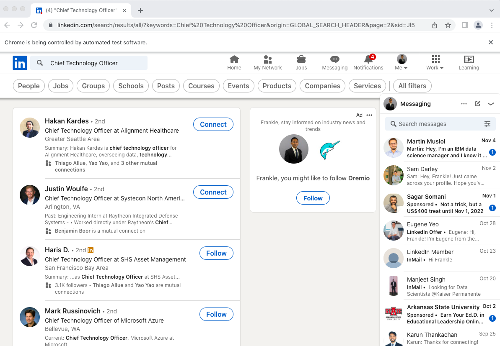

### Data Cleaning

1.  Initially, we compiled all the individual files into three, one for each attribute.

2.	Next, we cleaned the null values. There are multiple company pages that were scraped instead of people’s pages, but those pages did not have sections for education and skills, so it was easy to clean.

3.	As we just talked about, the skills were extracted in the form of lists. They were then converted into strings.

4.	Dropped duplicate profiles: some duplicate profiles got scrapped due to multiple search terms used for consultants.

5.	Extracted the dates from the degree strings using `regex`. An un-cleaned example is below:

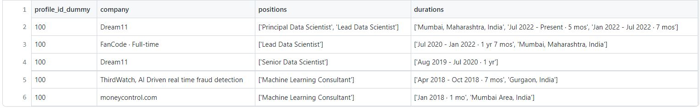

### Data Transformation

1.	Added a profile id (dummy variable) to uniquely identify individuals.
2.	String to date type conversions for experience and degree dates ranges.

```Python
    single_date = df_temp['durations_cleaned']

    split_list = single_date.split('-')

    today_end_date = 'Nov 2022'

    if len(split_list)==2:
        start = split_list[0].strip()
        end = split_list[1].strip()

        if end.lower() == 'present':
            end = today_end_date
    else:
        start = split_list[0].strip()
        end = start = split_list[0].strip()

    try:
        start = dateutil.parser.parse(start)
        end = dateutil.parser.parse(end)
    except:
        start = ''
        end = ''

    return start, end
```

3.	Converted the skills into a wide format using one-hot encoding, i.e. we made a superset of all the skills in our dataset and created a flag variable whose value would be one if the person possesses said skill, 0 otherwise.

```Python
exploded_skills_df = skills_df.explode('skills_list_cleaned').reset_index(drop=True)
exploded_skills_df['skills_list'] = exploded_skills_df['skills_list'].astype(str)
exploded_skills_df['val'] = 1
```

**Before transformation**
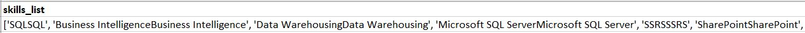

**After transformation**
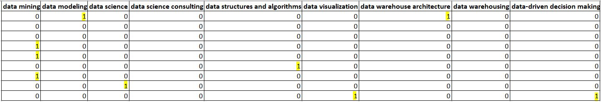


4.	On the other hand, we had to convert experience into long format for multiple roles worked within the same company. It was something of the format ['Chief Information Officer', 'Managing Director, Advanced Technology, Analytics, and Architecture'] before processing, but we converted it into five different rows, one for each position respectively.

5. The next step entailed creation of data to make it easy for analysis. This was achieved by performing relevant processing on each individual dataset. This would enable us to plot visualizations effectively. The following transformations were carried out:

#### 5.1 Education

##### 5.1.1 Level of Education

First off, we wanted to know what the highest level of education professional in all career roles have had. To find that out, we wrote a regex to extract if the professional had a certain level of education or not. This regex was made as exhaustive as possible to capture all the variations, including spelling mistakes in the text data.

To extract if a professional had a bachelor's degree or not, the following regular expression was used:
```Python
bachelor_pattern = (
    r'^(b\.{0,}\s{0,1}tech\.{0,}|b\.{0,}s\.{0,}|bachelor\’{0,}\'{0,}s{0,}|bachellor|'
    r'b\.{0,}sc\.{0,}|b\.{0,}a\.{0,}|b\.{0,}b\.{0,}a\.{0,}|b\.{0,}e\.{0,})(?:,|\)|\(|\s)'
)
```

Similarly, for master's the regex below was used:
```Python
master_pattern = (
    r"^(master\'{0,1}\’{0,1}s{0,1}|m\.{0,1}s\.{0,1}|m\.{0,1}a\.{0,1}|m\.{0,1}sc\.{0,1}|"
    r"m\.{0,1}eng\.{0,1}|mca|post graduate)(?:,|\)|\(|\s)"
)
```

We had used some other regular expressions to find out the possibility of a PhD and MBA as well.

The next step was to find out the highest level of education pursued. This was done using a simple if-else block.

```Python
def get_highest_level_of_edu(x):
    if 'phd' in x:
        edu_level = 'PhD'
    elif 'mba' in x:
        edu_level = 'MBA'
    elif 'master' in x:
        edu_level = 'Master'
    elif 'bachelor' in x:
        edu_level = 'Bachelor'
    else:
        edu_level = 'Other'
    return 
```

##### 5.1.2 Major

The second point analyzed from the data was the major. This was also implemented using regex as below
```Python
 stem_match = re.search(
        r"(computer|stat|physics|chem|math|data science|machine|quant|bio|operations research)", x)
```

It was then categorized further into fewer buckets like engineering, Business/Economics and STEM (Non-Engineering).

```Python
if 'engineer' in x:
        major_type = 'Engineering'
elif 'business' in x or 'econ' in x or mba_match is not None:
    major_type = 'Business/Economics'
elif 'engineer' not in x and stem_match is not None:
    major_type = 'STEM (Non-Engineering)'
else:
    major_type = ''
```

#### 5.2 Experience

##### 5.2.1 Total Duration
We first wanted to understand how much of experience is required in order to be a chief data scientist, CTO and Consultant respectively. First off, we fixed some outlier values for some of the professionals. One noteworthy example was of a professional whose job started in 1800s. This was fixed by filtering only the profiles which had their jobs starting after 1930.

The next step was to find out the total experience by finding the number of days between starting date of employment and the most recent date of employment. This was divided by 30 to obtain total months of experience.

##### 5.2.2 Previous Role
The second theme was to find out what kind of roles a certain professional has worked on. This would help us find a career path someone has followed. For example, a principal data scientist might have worked on an internship, data/business analyst, software engineering or other roles in the past to come to where he is now.

This was an easy process as we had separated out all the different roles a person had been into. The following code was used to find out different pre-set roles:

```Python
consultant_roles_df = previous_role_type_analysis(
    profile_type = 'Senior Consultants',
    exp_df = exp_df.copy(),
    role_title1 = r'(analyst|trainee|business analytics)',
    role_title1_name = 'Analyst Roles',
    role_title2 = r'intern',
    role_title2_name = 'Intern Roles'
)
```

##### 5.2.3 Months of Experience in the current company

This was achieved by ranking all the experiences in the descending order of experience ending date. The company with rank 1 (most recent company) was filtered and the duration was counted by subtracting the most recent date by starting date. This was again divided by 30 to get months of experience.

```Python
time_period_latest_company['months_of_exp_latest'] = round(
    ((time_period_latest_company['end_date'] - time_period_latest_company['start_date']).dt.days)/30, 0
).astype(int)
```

##### 5.2.4 Number of roles in the current company

The impetus behind the analysis was to find if the professional had directly switched into this role from any other company, or was promoted into this role.

Since we already had the positions held by each professional in each company, this was achieved by just counting the total number of roles for the recent company.

```Python
num_roles_latest_company = num_roles_latest_company.groupby(
    ['profile_category', 'positions']
)['profile_id_dummy'].nunique().reset_index()
```

### Data Reduction

A few initiatives were taken outside of data cleaning to further reduce the size of our data.

**Example 1**

We primarily ensured that all skills were in lowercase and then mapped similar skills with different names through `lemmatization`, WordNetLemmatizer(), and `mapping` to reduce redundant data.
```Python
lemmatizer = WordNetLemmatizer()

skills_df['skills_list_cleaned'] = skills_df['skills_list'].apply(
    lambda x: [lemmatizer.lemmatize(i.lower()) for i in ast.literal_eval(x)]
)
```

Remapped skills were then placed back into a consolidated skills list.
```Python
skills_remapping_dict = {
    'artificial intelligence (ai)':'artificial intelligence',
    'ai':'artificial intelligence',
    'agile methodologies':'agile',
    'agile project management':'agile',
    'amazon ebs' : 'amazon web services (aws)',
    'amazon ec2' : 'amazon web services (aws)',
    'amazon s3' : 'amazon web services (aws)',
    'aws' : 'amazon web services (aws)',
    'aws command line interface (cli)' : 'amazon web services (aws)',
    'aws s3' : 'amazon web services (aws)',
    'machine learning algorithms' : 'machine learning',
    'oracle pl/sql development' : 'oracle sql',
    'oracle sql developer' : 'oracle sql',
    'python' : 'python (programming language)',
    'python programming' : 'python (programming language)',
    'presentation' : 'presentation skills',
    'r' : 'r (programming language)',
    'r programing' : 'r (programming language)',
    'r programming' : 'r (programming language)',
    'r shiny application development' : 'r shiny',
    'sas certified base programmer' : 'sas (programming language)',
    'sas programming' : 'sas (programming language)',
    'sci-kit learn' : 'scikit-learn'
}

def remap_skills_basic(skills_list):
    '''
    helper function for remapping skills
    '''
    new_list = sorted(list(set(
        [
            skills_remapping_dict[i] if i in skills_remapping_dict.keys() else i 
            for i in skills_list
        ]
    )))
    return new_list
```

**Example 2**

We decided to not record profile locations because experience locations were initially recorded. However, this did not seem relevant to our overall objective, so we discarded it. 

**Example 3**

There were some experience values that were off the charts. So we considered the values that fall between 3 standard deviations of the mean.

```Python
upper_threshold = np.mean(overall_years_of_exp['months_exp']) + 3*np.std(overall_years_of_exp['months_exp'])
lower_threshold = np.mean(overall_years_of_exp['months_exp']) - 3*np.std(overall_years_of_exp['months_exp'])

overall_years_of_exp = overall_years_of_exp[
    (overall_years_of_exp['months_exp'] < upper_threshold) &
    (overall_years_of_exp['months_exp'] > lower_threshold)
].copy()
```

### Data Consolidation

**Step 1: Initial Concatenation**

Since our data was initially stored in individual `.csv` files for each profile scraped, we first needed to `concatenate` the profiles into respective datasets.

After establishing a connection with our files, we worked to confirm that education, experience, and skills keyword credentials were correctly listed in their respective files. 
```Python
main_df = pd.read_csv(MAIN_PROFILE_CSV)
print(main_df.head())


all_files = os.listdir(BASE_PATH)
print(len(all_files))

education_files = [i for i in all_files if 'education' in i]
experience_files = [i for i in all_files if 'experience' in i]
skill_files = [i for i in all_files if 'skill' in i]
```

Using a `helper function` for concatenating our data, we loaded all respective files into a single data frame for their variable topic, or their singular files for education, experience, and skills.
```Python
education_df = concatenate_dfs_helper(
    education_files,
    BASE_PATH
)

experience_df = concatenate_dfs_helper(
    experience_files,
    BASE_PATH
)

if SKILLS_DF_COMBINED_FILE != '':
    skills_df = pd.read_csv(
        BASE_PATH + SKILLS_DF_COMBINED_FILE
    )
else:
    skills_df = concatenate_dfs_helper(
        skill_files,
        BASE_PATH
    )

print(len(education_df['profile_id_dummy'].unique()))
print(education_df.shape)
print(experience_df.shape)
print(skills_df.shape)
```

**Step 2: Joining**

Datasets from our first run such as names, profile_url, and profile_heading were taken from `consultant_profile_links.csv` and joined with `experience info` to reduce time spent moving back and forth between tables. 
```Python
name_and_experience_df = pd.merge(
    long_experience_df,
    main_df,
    on = 'profile_id_dummy',
    how = 'left'
)
```

**Step 3: Concatenating and Merging**

We then `merged` and `concatenated` the different elements of profiles (education, experience, and skills) into datasets according to their profile position classification of data dcientist, CTO, and consultant.
```Python
import pandas as pd

#### Experience Table
ds = pd.read_csv('data/cleaned_data_science_files/name_and_experience_info.csv')
ds['profile_category'] = 'DataScience'
print(ds.head())

cto = pd.read_csv('data/cleaned_cto_files/name_and_experience_info.csv')
cto['profile_category'] = 'CTO'
print(cto.head())

consultant = pd.read_csv('data/cleaned_consultant_files/name_and_experience_info.csv')
consultant['profile_category'] = 'Consultant'
print(consultant.head())

exp_df = pd.concat(
    [ds, cto, consultant]
).reset_index(drop=True)

exp_df['profile_id_dummy'] = exp_df['profile_category'].astype(str) +  '_' + exp_df['profile_id_dummy'].astype(str)

print(exp_df.head())
print(exp_df.shape)
print(exp_df.columns)
exp_df.to_csv('data/final_cleaned_files/all_name_and_experience_info.csv', index=False)
```

### Data Dictionary
The data dictionary has been detailed out below in the form of a table. It contains information about three different csv files that were generated as the final set of files at the end of our data preparation process. The file that these specific columns are present in can be identified using the file name and path present in the column `Data`. <br><br>
<i>
Note:
- At the end of the data dictionary table, we have listed out only three out of 100s of such skills that are present in the `all_skills_info.csv` dataset because of the one-hot encoded wide format of this dataset. We carried out this encoding process to help us in making quick calculations to see which skills are listed by how many people.
- GitHub might not render these files directly due to the large number of columns present inside it.
</i><br><br>

| Attribute Name                | Description                                                                                                             | Data Type | Source                                                | Data                                                                                | Example                                                                                                                                                                                                                                                                                   |
| ----------------------------- | ----------------------------------------------------------------------------------------------------------------------- | --------- | ----------------------------------------------------- | ----------------------------------------------------------------------------------- | ----------------------------------------------------------------------------------------------------------------------------------------------------------------------------------------------------------------------------------------------------------------------------------------- |
| profile\_id\_dummy            | The nominal identifier assigned to the individual (used for uniquely identifying users and joining all tables together) | string    | Internally Generated                                  | [all_education_info.csv](data/final_cleaned_files/all_education_info.csv)   | This will contain unique indentifiers manually created by us like: "DataScience\_0", "Consulting\_0", etc.                                                                                                                                                                                |
| education\_institute          | The university/ institution the individual attended.                                                                    | string    | [https://www.linkedin.com](https://www.linkedin.com/) | [all_education_info.csv](data/final_cleaned_files/all_education_info.csv)   | UC Irvine, Landmark, Rice University, Harvard University, etc.                                                                                                                                                                                                                            |
| degree\_name                  | The specific degree level and focus.                                                                                    | string    | [https://www.linkedin.com](https://www.linkedin.com/) | [all_education_info.csv](data/final_cleaned_files/all_education_info.csv)   | BSBA Economics, MS Computer Science.                                                                                                                                                                                                                                                      |
| start\_year\_degree           | The year the individual began working on their degree.                                                                  | integer   | [https://www.linkedin.com](https://www.linkedin.com/) | [all_education_info.csv](data/final_cleaned_files/all_education_info.csv)   | 2010, 2009, 1997, 1975, etc. (will be 1900 if no data was available)                                                                                                                                                                                                                      |
| end\_year\_degree             | The year the individual completed their degree.                                                                         | integer   | [https://www.linkedin.com](https://www.linkedin.com/) | [all_education_info.csv](data/final_cleaned_files/all_education_info.csv)   | 2014, 2013, 2001, 1979, etc. (will be 1900 if no data was available)                                                                                                                                                                                                                      |
| profile\_category             | The career field of the individual (The categories that we have decided to analyze for this project)                    | string    | Internally Generated                                  | [all_education_info.csv](data/final_cleaned_files/all_education_info.csv)  | Data Science, Consultant, CTO                                                                                                                                                                                                                                                             |
| profile\_id\_dummy            | The nominal identifier assigned to the individual (used for uniquely identifying users and joining all tables together) | string    | Internally Generated                                  | [all_name_and_experience_info.csv](data/final_cleaned_files/all_name_and_experience_info.csv) | This will contain unique indentifiers manually created by us like: "DataScience\_0", "Consulting\_0", etc.                                                                                                                                                                                |
| company                       | The name of the company the person has worked for.                                                                      | string    | [https://www.linkedin.com](https://www.linkedin.com/) | [all_name_and_experience_info.csv](data/final_cleaned_files/all_name_and_experience_info.csv)  | Tesla, Ford, Reliance Industries Limited.                                                                                                                                                                                                                                                 |
| positions                     | The position within a company held by the individual.                                                                   | string    | [https://www.linkedin.com](https://www.linkedin.com/) | [all_name_and_experience_info.csv](data/final_cleaned_files/all_name_and_experience_info.csv)  | CTO, Chief Data Analyst, Senior Data Scientist, Associate Partner, Principal Data Scientist                                                                                                                                                                                               |
| durations\_cleaned            | The date that is left in string format.                                                                                 | string    | [https://www.linkedin.com](https://www.linkedin.com/) | [all_name_and_experience_info.csv](data/final_cleaned_files/all_name_and_experience_info.csv)  | May 2010 - May 2012, June 2015 - July 2022                                                                                                                                                                                                                                                |
| start\_date                   | The begining of the individual's tenure was their role within the company as actual date columns.                       | date      | [https://www.linkedin.com](https://www.linkedin.com/) | [all_name_and_experience_info.csv](data/final_cleaned_files/all_name_and_experience_info.csv)  | 2006-11-03, 2010-05-03                                                                                                                                                                                                                                                                    |
| end\_date                     | The end of the individual's tenure was their role within the company as actual date columns.                            | date      | [https://www.linkedin.com](https://www.linkedin.com/) | [all_name_and_experience_info.csv](data/final_cleaned_files/all_name_and_experience_info.csv)  | 11-3-2010, 2012-05-03                                                                                                                                                                                                                                                                     |
| names                         | The first and surname of the professional.                                                                              | string    | [https://www.linkedin.com](https://www.linkedin.com/) | [all_name_and_experience_info.csv](data/final_cleaned_files/all_name_and_experience_info.csv)  | David Benham, Siddharth Mahapatra, Vamsi Nellutla, etc.                                                                                                                                                                                                                                   |
| profile\_url                  | The URL address for the professional's linkedin profile.                                                                | string    | [https://www.linkedin.com](https://www.linkedin.com/) | [all_name_and_experience_info.csv](data/final_cleaned_files/all_name_and_experience_info.csv)  | [https://www.linkedin.com/in/david-benham-4582b755](https://www.linkedin.com/in/david-benham-4582b755)                                                                                                                                                                                    |
| profile\_heading              | The written heading section on the professional's LinkedIn profile.                                                     | string    | [https://www.linkedin.com](https://www.linkedin.com/) | [all_name_and_experience_info.csv](data/final_cleaned_files/all_name_and_experience_info.csv)  | [https://www.linkedin.com/in/david-benham-4582b755?miniProfileUrn=urn%3Ali%3Afs\_miniProfile%3AACoAAAuc1MQBqmRe5MvgDqNH9CmL8LcaUgOGaGk](https://www.linkedin.com/in/david-benham-4582b755?miniProfileUrn=urn%3Ali%3Afs_miniProfile%3AACoAAAuc1MQBqmRe5MvgDqNH9CmL8LcaUgOGaGk)             |
| profile\_category             | The career field of the individual (The categories that we have decided to analyze for this project)                    | string    | Internally Generated                                  | [all_name_and_experience_info.csv](data/final_cleaned_files/all_name_and_experience_info.csv)  | Data Science, Consultant, CTO                                                                                                                                                                                                                                                             |
| profile\_id\_dummy            | The nominal identifier assigned to the individual (used for uniquely identifying users and joining all tables together) | string    | Internally Generated                                  | [all_skills_info.csv](data/final_cleaned_files/all_skills_info.csv)         | This will contain unique indentifiers manually created by us like: "DataScience\_0", "Consulting\_0", etc.                                                                                                                                                                                |
| all\_skills\_link             | LinkedIn link for fetching all the skills from for each individual profile                                              | string    | [https://www.linkedin.com](https://www.linkedin.com/) | [all_skills_info.csv](data/final_cleaned_files/all_skills_info.csv)         | [https://www.linkedin.com/in/anindya-dey-396479a/details/skills?profileUrn=urn%3Ali%3Afsd\_profile%3AACoAAAHZReIBZ3Y1g0OqzJZIzKt29h0EIV-tSzc](https://www.linkedin.com/in/anindya-dey-396479a/details/skills?profileUrn=urn%3Ali%3Afsd_profile%3AACoAAAHZReIBZ3Y1g0OqzJZIzKt29h0EIV-tSzc) |
| skills\_list                  | The skills listed on the indivdual's LinkedIn profile under their 'Skills' section (in list format)                     | list      | [https://www.linkedin.com](https://www.linkedin.com/) | [all_skills_info.csv](data/final_cleaned_files/all_skills_info.csv)         | \[Python, C#, Communication, Public Speaking, Presentation\]                                                                                                                                                                                                                              |
| c#                            | Indicator whether the person has listed this as their skill or not (expanded wide format of skills\_list column)        | integer   | [https://www.linkedin.com](https://www.linkedin.com/) | [all_skills_info.csv](data/final_cleaned_files/all_skills_info.csv)          | 1/0 binary variable                                                                                                                                                                                                                                                                       |
| python (programming language) | Indicator whether the person has listed this as their skill or not (expanded wide format of skills\_list column)        | integer   | [https://www.linkedin.com](https://www.linkedin.com/) |[all_skills_info.csv](data/final_cleaned_files/all_skills_info.csv)          | 1/0 binary variable                                                                                                                                                                                                                                                                       |
| data warehousing              | Indicator whether the person has listed this as their skill or not (expanded wide format of skills\_list column)        | integer   | [https://www.linkedin.com](https://www.linkedin.com/) | [all_skills_info.csv](data/final_cleaned_files/all_skills_info.csv)        | 1/0 binary variable                                                                                                                                                                                                                                                                       |
## Visualizations

In this project, our primary goal is to analyze how people at top positions in three different career tracks have built up their careers in terms of skills developed, education levels, and past experiences. To analyze this, we have scrapped LinkedIn profiles from three career tracks (Principal Data Scientists, Senior Consultants, and Chief Technology Officers) and analyzed the information that these people have listed in terms of skills, education levels, and past experiences on LinkedIn. These are the three main components we will be looking at, and the following three exploratory analyses listed are the three main stories we will be focusing on:
1. Skills: We will be analyzing the skills that the people from these three different career paths listed on their LinkedIn and if there are certain specific skills that people interested in one of the paths should actively pursue.
2. Education: For education, we will look at two main aspects, the education levels and the majors pursued by the professionals from the above-mentioned career paths. Based on this, we will analyze if there are any common patterns for each path.
3. Experience: For experience, we will mainly analyze the past experiences of the professionals in the three paths. We will analyze three aspects related to experience, the number of months of work experience held by the professionals previously before their current roles,  past roles held by these professionals, and finally, the number of years/number of positions held by these professionals at their current companies.

### Target Variable and Predictive Analytics Problem:
The goal of the project is to mainly work on the exploratory data analysis (EDA) part and try to find interesting patterns in terms of skills, education, and experience that are specific to each of the career paths mentioned earlier. These patterns can help people (students, early career professionals, and even experienced professionals) streamline their career paths. We can build predictive models to gauge which career path will suit best for a person based on their existing skills, education, and experience. Hence, we can also frame a Multinomial Classification Problem with 'Career Path' as the target variable and predict the path with the highest likelihood by using the information related to skills, education levels, and experience as predictor variables.<br>
All the visualizations and analyses shown below will be segregated based on the three career paths mentioned. These visualizations will explore the relationship between these career paths with various other variables related to skills, education, and experience.

### 1. Skills (Technical & Non-Technical)

##### Principal Data Scientists
The following graph shows that Python is indeed the top skill possessed by 80% of principal data scientists, followed by Machine Learning. R programming language stands 3rd. This clears one of the major confusions potential data scientists have: whether to go with Python or R. Our analysis says Python and R both are important, but if you have to pick one, Python is your way to go.

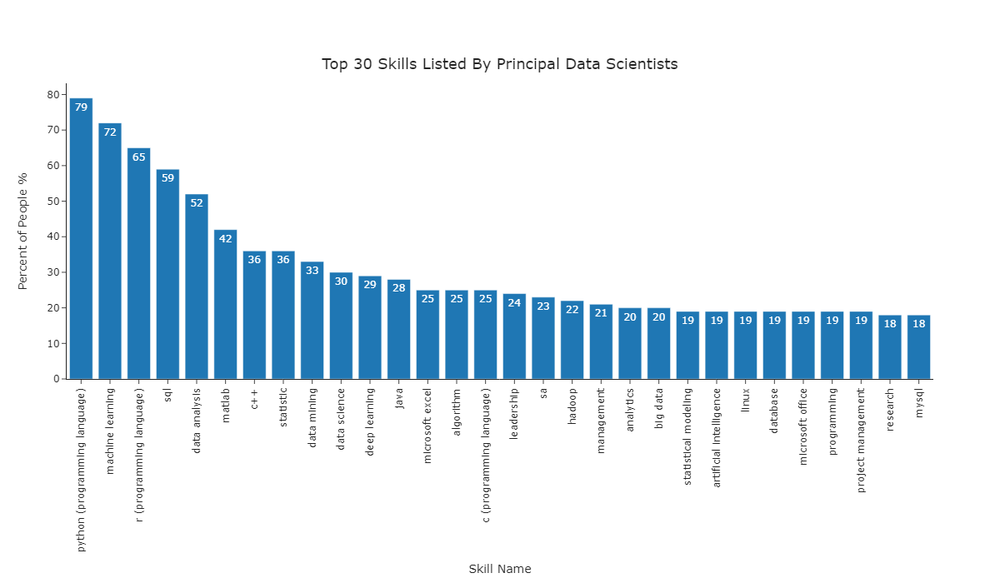

Note that these categories are not mutually exclusive, and a professional might have multiple skills that they bring to the table.

##### Senior Consultants
When it comes to senior consultants, business strategy is the top skill. As we will see in upcoming section about education, most of the consultants have an MBA. So, the readers of this playbook should focus on getting MBA in strategy if they wish to be consultants.

Also, the point to note is that after 4 management related topics, data analysis shows up. It is probably one of those good-to-have skills learnt by 42% of consultants.

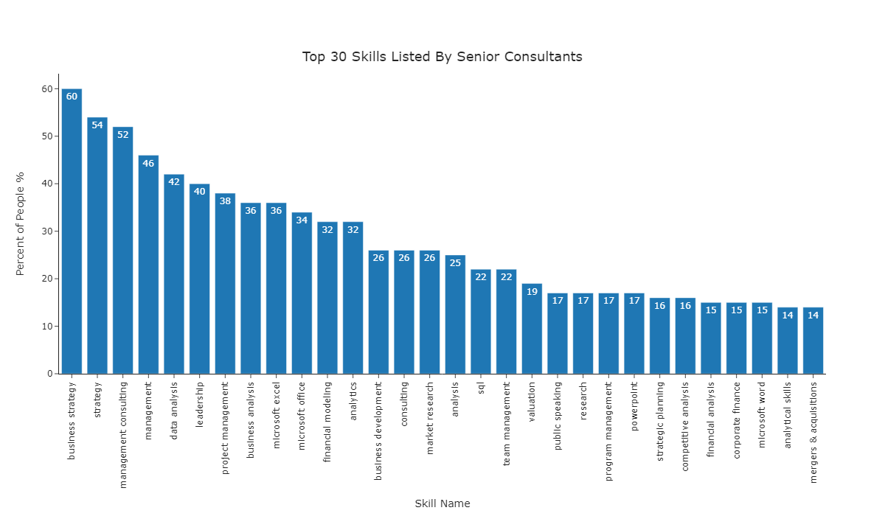

##### Chief Technology Officers

CTOs are a mixed bag of skills. They do not have a major skill that differentiates them, instead, they have 5 skills that are acquired by the somewhat equal number of CTOs. The top 5 skills are: Management (48%), software engineering (48%), Cloud computing (47%), leadership (47%) and finally agile (45%)

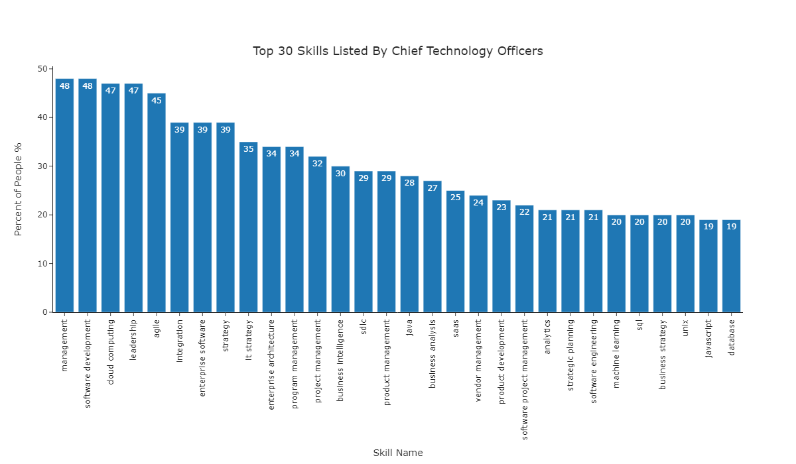

### 2. Education

Moving onto our second story, let’s take a deep look into what education background one ought to take to climb the ladder of success towards Principal Data Scientists, Senior Consultants, or Chief Technology Officers, broken down by the most popular education levels and majors for each profile type.

#### 2.1 Highest Education Level

Referencing the image below, let’s look at the percentage of people compared to education levels. The majority of Principal Data Scientists, or 83%, have completed a Master’s or PhD. Very few have obtained an MBA or just a Bachelor’s, proving that this field, in particular, requires the highest level of education. Moving over to Senior Consultants, 61% have completed their MBA, excessively overshadowing those who have acquired a Master’s, Bachelor’s alone, or PhD. Finally, there is relative wiggle room when it comes to Chief Technology Officers. Creating a career from just a Bachelor’s was the most popular route, with 30%, but with a 4% difference from Master’s to PhD, MBA, and Other, it may be concluded that experience trumps education within this domain. 

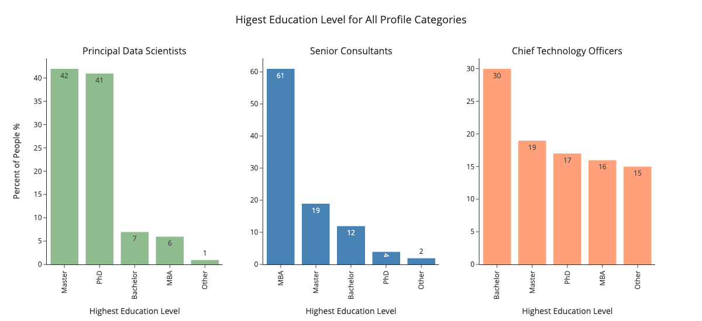

#### 2.2 Most Popular Majors

While we now know what types of degrees are popular amongst the leaders of each field, it’s important to set the path for success up right by understanding which degree ought to be pursued. Referencing the image below, the percent of people within each field is compared to Types of Majors. Starting with Principal Data Scientists, STEM (Non-Engineering) tops the charts with 31% obtaining degrees like Master’s in Data Science, Physics, or Computer Science. Next in line is plain Engineering at 20%, which includes those with PhD’s or Master’s, supporting the previous findings from Principal Data Scientists most popular highest education. In total, Engineer associated degrees make up 76% of the total majors within this realm, Engineering & STEM meaning they got one or the other in undergrad with the other as a Master’s or PhD. When looking at Senior Consultants, 39% majored in Engineering and completed an MBA. Following in a close second, many consultant professionals majored in Business. Both conclusions make sense as Consultants’ work utilizes soft skills for presentation of data cross industry. For this career path, one can’t go wrong with combining Business and Engineering or STEM. Like Principal Data Scientists, Chief Technology Officers’ popular degrees readily move from STEM (Non-Engineering) like Data Science, to Engineering such as Computer Science degree, so on to Other, MBA, etc. To advance into this position, a degree palate of Data or Computer Science with an incorporation of Business skills would be best. 

Planning out a degree path to reach the preferred career goal can seem intimidating. After looking at the data, it’s evident that the most relevant degrees across the board are STEM (Non-Engineering), Engineering, and Business. Obtaining a Master’s in Data Science, Computer Science, or Business Administration are all great choices. A PhD can be helpful for Principal Data Scientistic but is not necessarily needed to climb the ladder of Senior Consultants or CTOs.

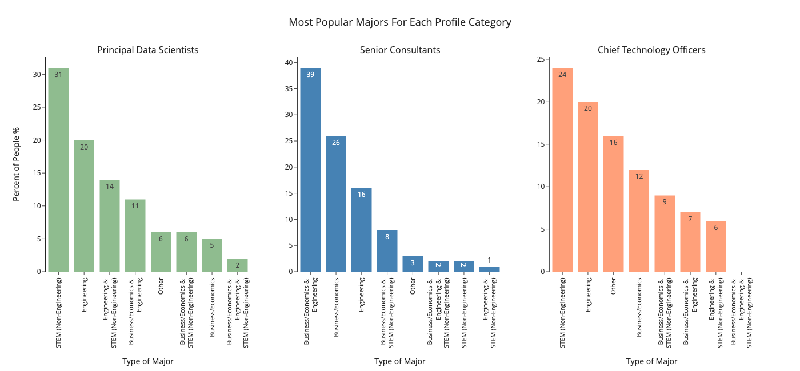

### 3. Experience

Going beyond Skills and Education, the final piece to the story is Experience. Here we will uncover the amount of experience (in months) prior to the acquiring positions, previous roles held, experience (in months) at current company, plus number of positions held at the current company (internal promotions) of Principal Data Scientists, Senior Consultants, and CTOs. 

#### 3.1 Experience Needed Prior to Position

We will begin by looking at the number of years of expereince that these professionals had before they entered into their current roles. This will help the people in gauging the average years of experience required for landing these different types of roles. 

##### Principal Data Scientists

Everyone starts somewhere, and experience is essential to climbing the ladder of career success. When comparing the percentage of people to months of experience, for Principal Data Scientists, 40-139 months, or about five to 11 years, is the amount of time it took to get to this position. Months of experience ranges from 0-19 months all the way to 260-270 months, as seen in the right skewed bar chart. 

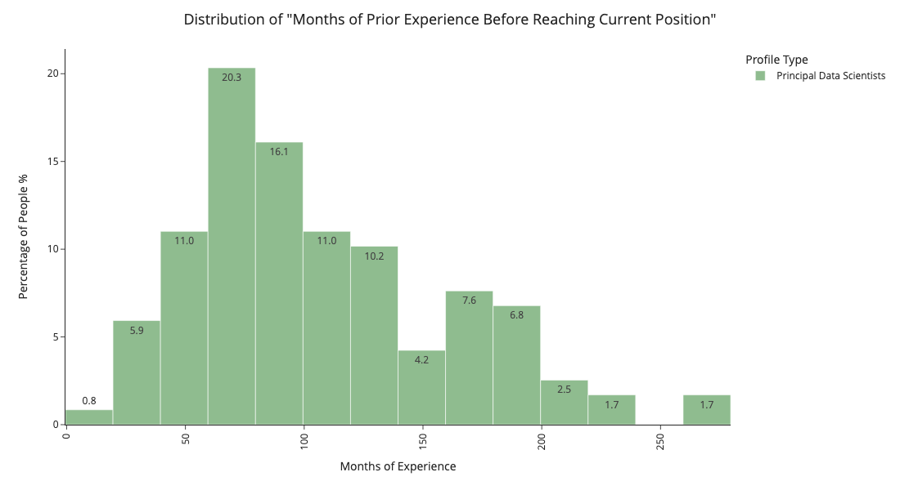

##### Senior Consultants

Similarly skewed, Senior Consultants most prevalent experience is shorter, falling within 20-119 months, or a little over a year to 10 years of experience. This might be due to the known long hours that come with being a consultant.

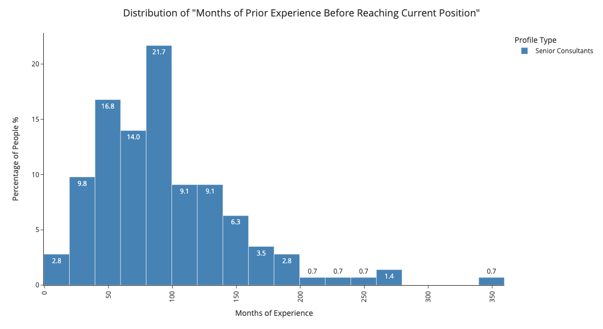

##### Chief Technology Officers

Displaying a more normalized distribution, it’s evident that working up to a CTO requires a lot of experience. In this bar graph, many CTOs have 100 to 259 months, or eight to 13 years, of prior work experience. Patience is a virtue!

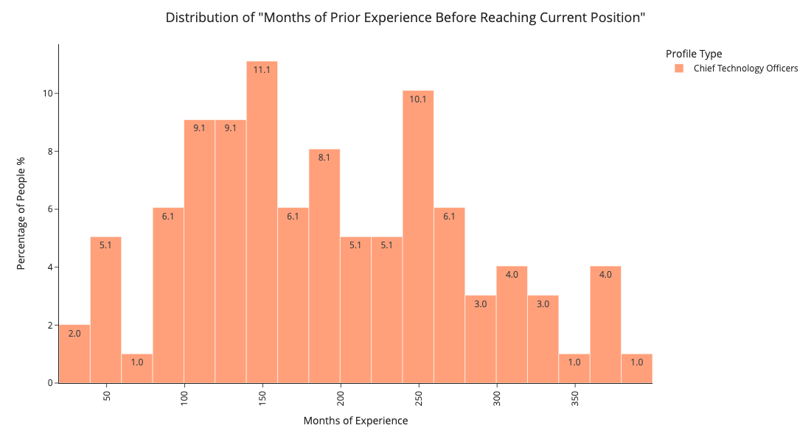

#### 3.2 Previous Roles Held by the Professionals

As we were talking about having to begin from somewhere, we will now move on to looking at some specific roles that the professionals held prior to landing their current roles. These can help us in understanding the roles that these senior professionals have used as building blocks to progress further in their careers. Additionally, it can also help people looking for switching careers in assessing how easy or difficult it would be to move on from their current roles to one of the paths that we are analyzing.

##### Principal Data Scientists

For Principal Data Scientists, based on our background understanding, we have picked up three related or early career positions that could be relevant for Principal Data Scientists. These three roles are "Data Science/Analyst Interns", "Data/Business/Research Analyst Roles", and "Software Engineer/Any Other Engineering Roles". We are analyzing the % of professionals that have previously held these roles at some point in their careers. The observations from the chart below show us that around 26% of the Principal Data Scientists have held some Intern roles previously in their careers. This tells us that data science internships can be a good way for students to break into the field and work their way upward in this career path. Around 21% of them have held an Analyst (Data/Business/Research) role in the past which tells us that people can begin their professional careers as analysts and slowly move up the ladder into becoming Principal Data Scientists (It's not the end of the world if you have to begin your career as a Business Analyst). Finally, there's a good proportion of engineers (around 29%) switching to become Principal Data Scientists. This makes sense as the two fields are quite closely related and the skills are quite transferable. So, if someone is planning to switch their career from this field, it's a good bet.

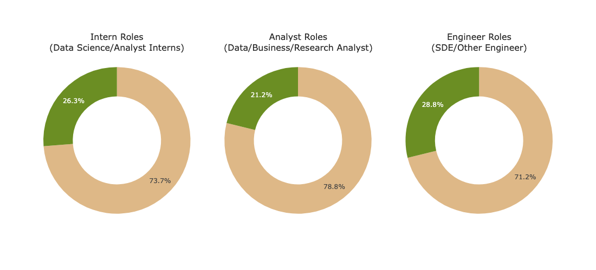

##### Senior Consultants

For Senior Consultant, again, we have picked up professionals that held some Analyst Roles (Associate Analysts, Business Analysts, Research Analysts - we chose these because most consultants at the Big4 firms start out their careers as analysts and associates) and Internship Roles. We are analyzing a similar metric i.e. % of professionals that have previously held these roles in their careers. The chart below shows us that around 34% of these professionals start out as analysts and around 38% of them have interned at some point in their careers. Hence, internships and analyst roles are good entry-level roles for breaking into the consulting world.

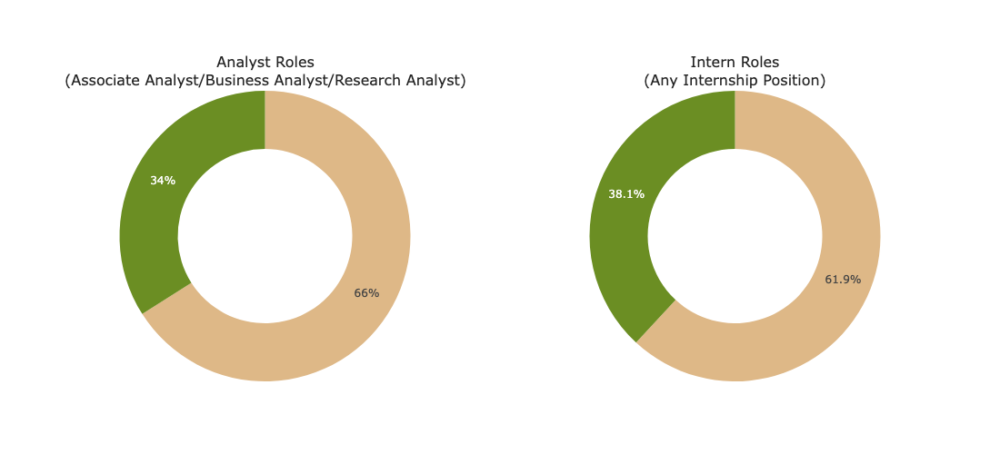

##### Chief Technology Officers

For Chief Technology Officers, we decided to analyze more senior positions compared to the other two career paths since the role of the CTO is also a significantly more senior role and people with senior engineering positions or managerial positions are the ones usually moving into this position. We picked Managerial Roles (Team Leads, Project Leads, Project Managers) and Senior Engineering Roles (Software Architect, Staff Software Engineer, Research Scientist) as the two past roles that we would be looking at for CTOs. The metric being analyzed is the same as the previous two i.e. % of professionals. The chart shows us that 38% of CTOs have held some managerial role in the past and around 33% have held a senior engineering or research role in the past. This shows us that people eyeing the role of a CTO as a part of their future career plans should focus on obtaining some much-needed managerial experience or focus on becoming technical experts in their fields.

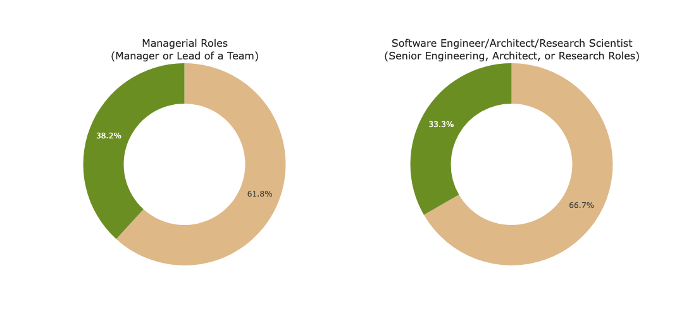

#### 3.3 Experience(in Months) at Current Company and Number of Internal Promotions within Current Company

In this final section, we will be analyzing the distribution of the number of months these senior professionals have spent at their current companies and also the number of positions they have held at their companies. The objective of analyzing this is to understand how much loyalty is worth in each of these paths and if one of them tends to reward loyalty more than the others. This can also help people in understanding if they should go job hunting to move up in their careers or stick around and work their way up through internal promotions. 
We will begin by looking at the distribution of the number of months of experience the professionals have stuck with their current companies and then we will move on to analyzing the number of internal promotions (measured in terms of number of positions held at the current company) that they have had within their current companies.

##### Principal Data Scientists (Experience at Current Company in Months)

We can see from the distribution that the distribution of months of experience for Principal Data Scientists is concentrated towards the lower end with around 33% of people in the first bin and around 76% having less than 50 months. This shows that people in data science tend to switch jobs sooner than the other two paths. However, this could also be biased due to data science being a relatively newer field compared to the other two paths that we are analyzing.

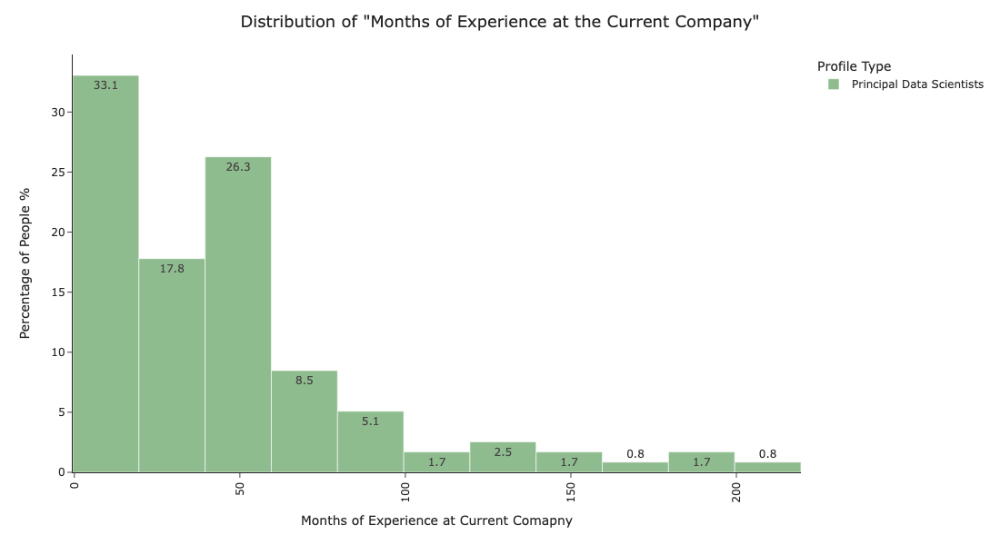

##### Senior Consultants

Based on the distribution, Senior Consultants tend to be more loyal than Principal Data Scientists with just 23.8% of people in the first bin and just 52% with less than 50 months (compared to 76% for Principal Data Scientists). This potentially shows us that the top consultancy firms tend to focus on more internal promotions for filling senior positions (like Partner, Associate Partner, and Principal) rather than direct external hires. They seem to like to push people they have groomed into these senior consultancy roles.

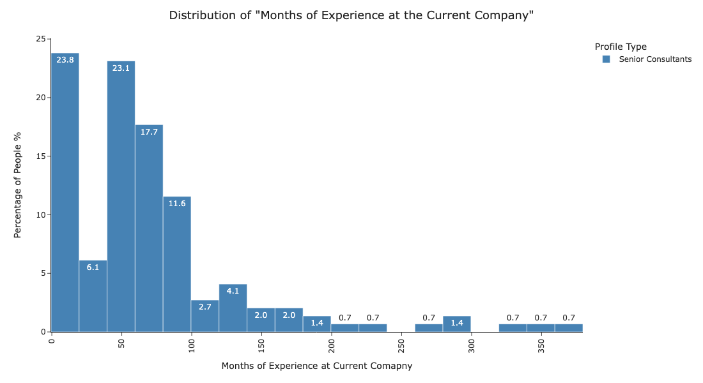

##### Chief Technology Officers

We have a slightly surprising observation for Chief Technology Officers. Based on the distribution, they tend to have spent more time at their current companies compared to Principal Data Scientists but seem to have spent a lower amount of time compared to Senior Consultants (63% of people have spent less than 50 months compared to 76% for Principal Data Scientists and 52% for Senior Consultants). We expected professionals from this path to have spent the highest number of months with their companies since it's a much more senior role compared to the other two. However, it might just be due to the data that we scraped that could be biasing this result. We could have potentially scraped a higher number of CTOs that are also founders of their own companies rather than CTOs from Fortune 500 firms. This could be driving the number that we see and cross-checking the data can help us confirm it.

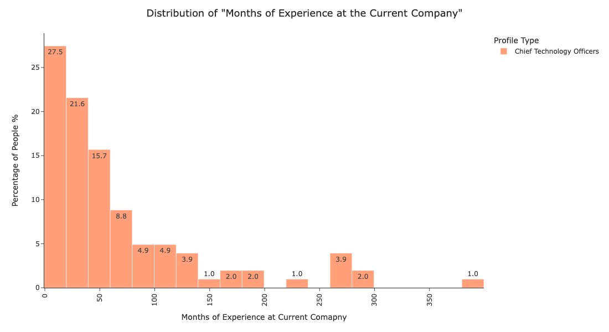

##### Number of Internal Promotions within Current Company

Here, we are trying to analyze the number of positions that professionals have held within their current companies. This can be a proxy for the number of internal promotions professionals have gotten within their current companies. We are analyzing the % of people for each number of positions (a proxy for the number of promotions). The observation from the chart below is in line with what we observed from the histograms of the months of experience in their current companies. It shows us that a larger % of Senior Consultants tend to have worked their way up a much higher number of internal promotions within their companies and tend to be more loyal.

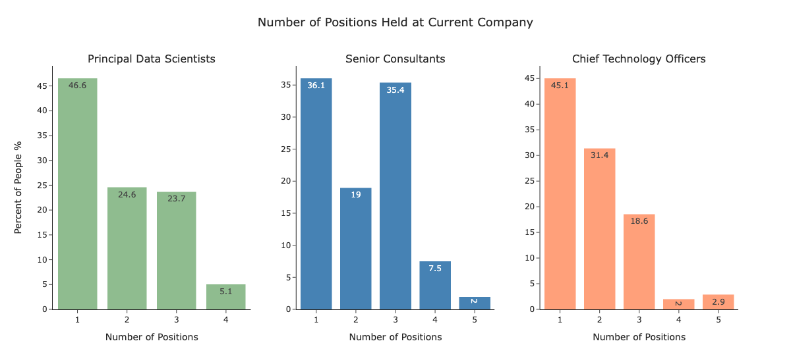


## Conclusion and Discussion
In the data gathering and consolidation phase of the project, we started by identifying the methods that were available to us for gathering and extracting data from LinkedIn. This essentially boiled down to two main techniques for obtaining the data: `LinkedIn APIs` and `Web Scraping`. We decided to go ahead with the scraping approach because of the requirements associated with getting an API key and the rate limits that were involved in using the APIs. Additionally, we wanted to put our recently attained scraping skills to the test. 

We used the `selenium library` as our key tool for scraping profile links and individual profile information from LinkedIn. There were two major challenges that we faced while trying to scrape this information using selenium:<br>
- Trying to avoid getting blocked by LinkedIn and trying to avoid being hit with a captcha in the middle of the scraping process and losing all the       progress achieved.
- Speeding up the scraping process in order to be able to scrape more profiles in a shorter span of time.

We used a few hacks to solve these issues like applying random `sleep timers` to pause the code for a while, saving files in each loop to maintain progress, and using `multiprocessing` to parallelly create multiple instances of selenium and scrape multiple profiles at once. We believe that some of these might not be the best way to solve these problems and there might be better ways to handle these issues like the following:<br>
- Using proxy IP addresses and rotating them regularly to avoid getting blocked
- Analyzing if scraping the website actually needs selenium due to dynamic JS elements. It might be much faster to scrape using a combination of           `requests`, `beautiful_soup`, and `multithreading` if there are no dynamic JS elements involved.
- Saving progress in batches instead of each and every file to speed up the process and reduce the number of times we are writing csv files.
<br>
In the next phase of our project, we will be analyzing the information that we has been collected on the experience, education, and skillsets of multiple top profiles in three different fields. Our goal is to find common patterns that successful people in these fields have followed in the past. We will start looking at their education, how the early phases of their careers started, and the path that they took to reach where they are today. We will also analyze the top skills and educational degrees that people in each of these fields tend to have. 
<br><br>
Finally, using the insights obtained from our exploratory analysis, our goal is to create a playbook that university students, early career professionals, people looking to switch careers, and people returning to the workforce after a career break can follow in order to help them be successful in their pursuit of these fields. The outcomes and insights from this project can serve as a guidance tool or reference book for our target audience so that they are not lost and have a focused path to follow in order to achieve their dream positions in the industry. It could also help young professionals and students develop the right skill sets required


