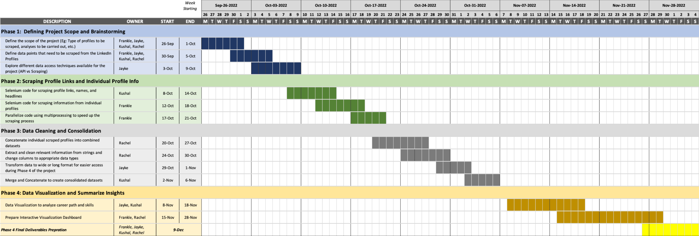
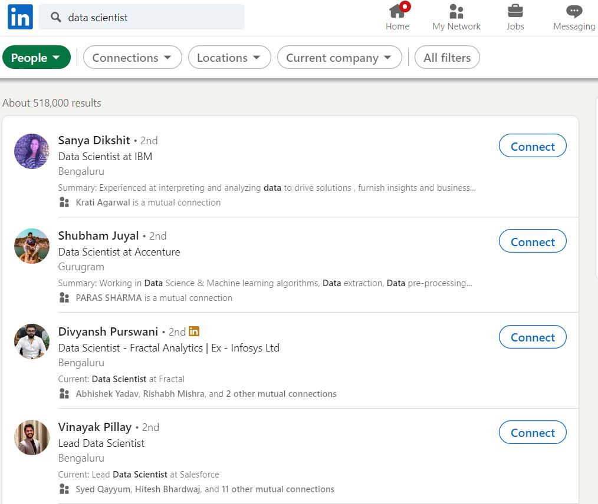
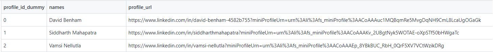
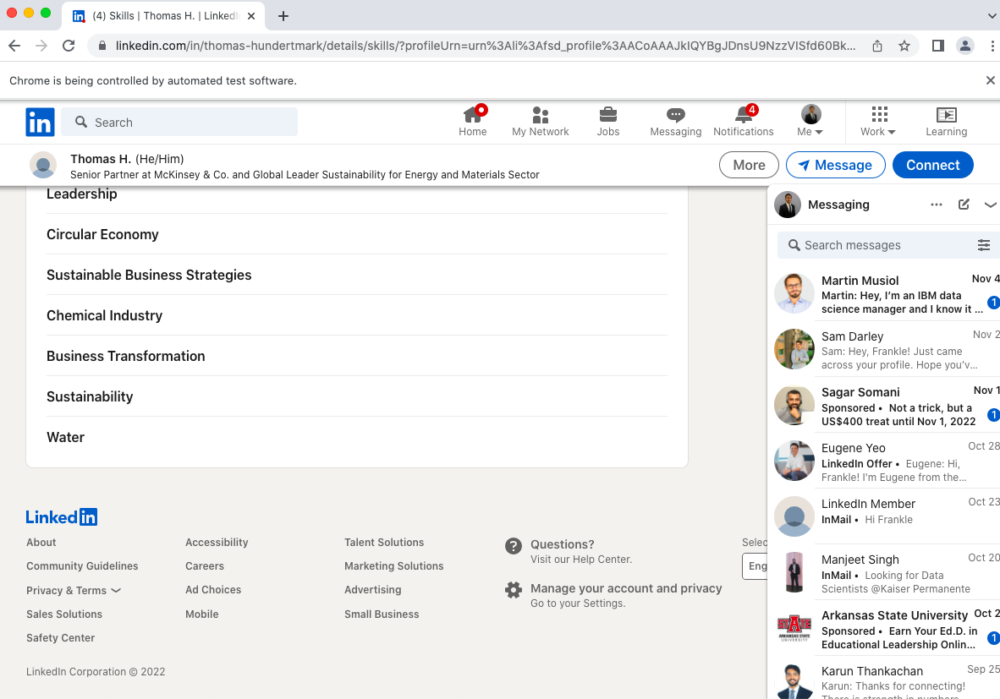
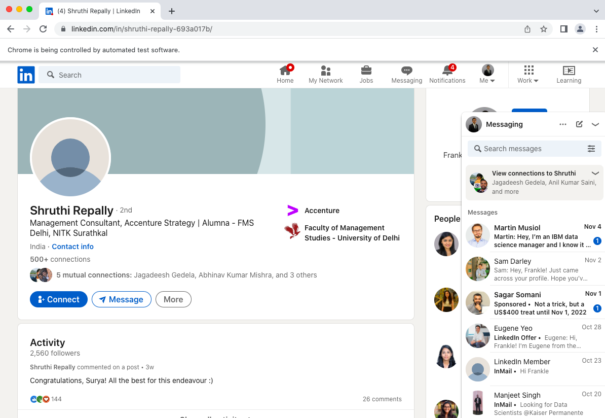
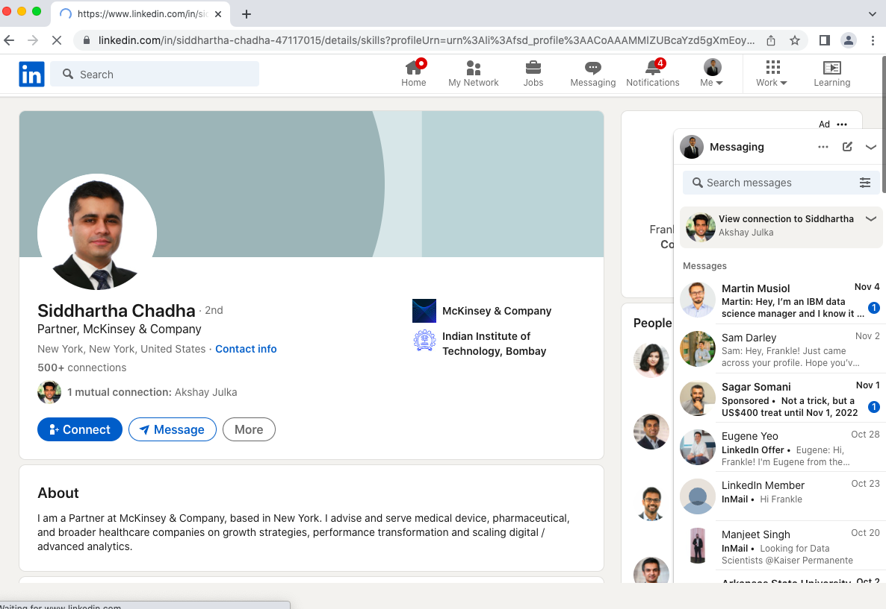
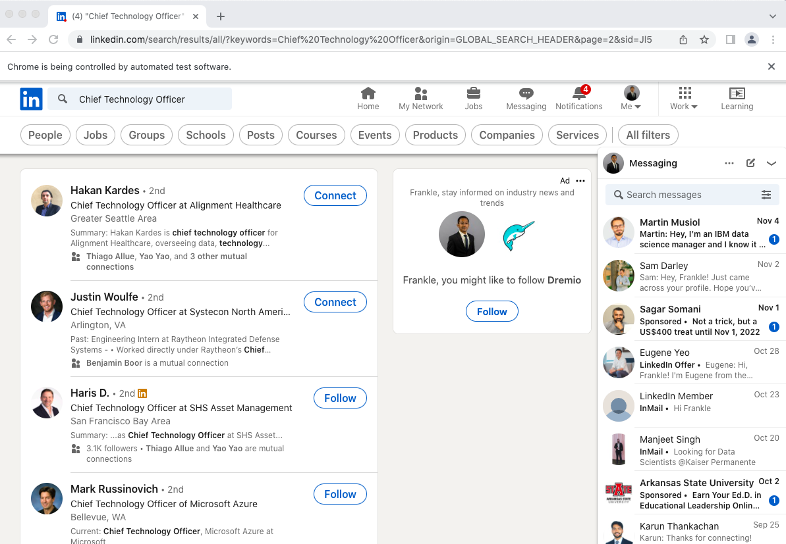
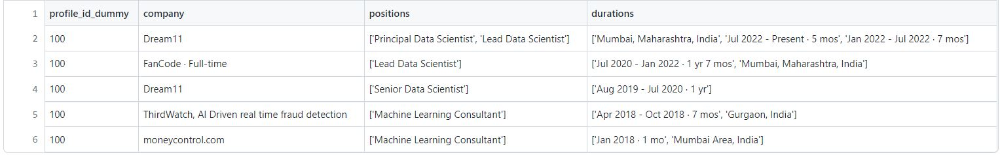
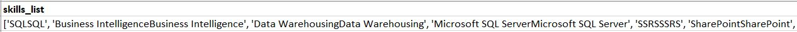
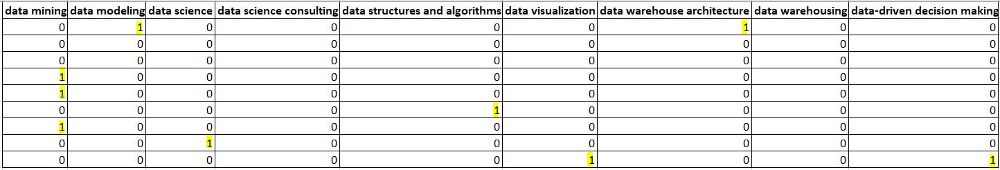

# Analysis of LinkedIn Profiles to Create a Career Success Playbook

The goal of this project is to analyze the career paths of multiple top professionals (e.g., CTOs, Marketing Heads, Lead Data Scientists, Lead Software Engineers, Product Managers, etc.) and build a career success playbook. This playbook could potentially act as a guide to help people be more job-ready or move up the corporate ladder by taking inspiration from the paths of professionals who have already reached the top of the ladder.<br><br>
Having the right skillset increases the “job readiness” of the candidates and reduces the investment an employer needs to make in re-training their hirees. Employers have reported that there is a steadily widening “skills gap” that is hurting workers, businesses, and the economy.[1] There are also reports explaining how skill-based hiring has been increasing over the past few years.[2] So, having the right skills to focus on for a dream job has become even more important. We envision that the playbook will be helpful for current students, early career professionals, people looking for work after a resume gap, and professionals looking to switch careers by obtaining the right skill sets based on their career goals.
<br><br>
[1] https://www.businessroundtable.org/policy-perspectives/building-americas-tomorrow-ready-workforce/closing-the-skills-gap/the-skills-gap-explained
<br>
[2] https://hbr.org/2022/02/skills-based-hiring-is-on-the-rise

## Statement of Scope

This project is aimed at finding the career paths that stalwarts of their fields have followed. This will help readers be more task oriented about the career path they choose to follow. 

We plan to look for 3 different careers:
- Data Scientist
- Chief Technology Officer (CTO)
- Principal Consultant

We plan to get the following data points from mentioned successful individuals:
- Level of education (High school, Bachelors, Masters or PhD)
- Type of education (MBA or MS, Engineering or Hospitality, Technology or Biology)
- Total experience
- Designations worked on (business analyst, software engineer, senior software engineer, etc.)
- Skill set possessed

We then intend to analyze the following data points to obtain the career paths they have followed:
- Average experience in each company (will help our readers know the ideal time to switch companies)
- Most popular education by career path
- The most popular skills by career path

The entire analysis will be performed in Python

### Deliverables:

**Deliverable 1** : Code for data collection, cleaning, and transformation along with the data

**Deliverable 2** : Code for data analysis, visualizations, final codes, recommendations and conclusion

## Project Schedule

<b>Latest Timeline can be accessed [here](https://ostatemailokstate-my.sharepoint.com/:x:/g/personal/frankle_muchahary_okstate_edu/Ef3mrzskz0dKpTYlkwk5pbABStkzqWkWmAJBvBvxiZKOnQ?e=D2QEQ9)</b>



## Data Preparation

The data preparation process of this project involves searching for profiles on `LinkedIn` for three types of positions using multiple keywords, extracting profile links of multiple professionals in these fields, scraping information from individual profiles, and cleaning/consolidating data. These careers/positions are Chief Technology Officer, Principal Data Scientists, and Management Consultants. We carried out the scraping process in a two-step process where we first fetched the links, followed by detailed information from each profile, further detailed below. `Selenium` has been used as the key tool for scraping and `multiprocessing` has been used to aid in speeding up the process. Further, we have cleaned and transformed the scraped data using `regex`, `pandas`, and `dateutil`. At the end of the entire process, this scraped data has been saved as three different files, each containing three different sets of information, i.e `eduation information`, `experience information`, and `skills information`. We did not merge these three datasets into one single consolidated master file as a part of our data preparation step because they contain different sets of information that will mostly be analyzed individually (or could be merged as and when required for our analysis). Additionally, all three are at different levels of granularity, which will be detailed below. However, `profile_id_dummy` is the key that can be used to tie all three datasets back together. Further information on all the steps of our data preparation process has been detailed below.

**Final Datasets**
- [all_education_info.csv](data/final_cleaned_files/all_education_info.csv): Education Data for all profiles
- [all_name_and_experience_info.csv](data/final_cleaned_files/all_name_and_experience_info.csv): Professional Experience Data for all profiles
- [all_skills_info.csv](data/final_cleaned_files/all_skills_info.csv): List of skills listed in each profile

**Code Files**
- [get_profile_links.py](code/get_profile_links.py): Code for scraping profile links from LinkedIn for each profile type
- [clean_scraped_data_part0.py](code/clean_scraped_data_part0.py): Code for cleaning up the profile links fetched and adding dummy profile ids
- [scrape_individual_profiles.py](code/scrape_individual_profiles.py): Code for fetching information from individual profiles
- [clean_scraped_data_part1.py](code/clean_scraped_data_part1.py): Code for cleaning up all the information fetched from each LinkedIn profile
- [concatenating_and_merging.py](code/concatenating_and_merging.py): Code for final consolidation of all files to create 3 base files

### Data Access

First, we started with setting some parameters around the profiles we needed to search for, the number of profiles to be scraped, and the output file name. Here, `SEARCH_TERM` is the search term we will be entering into the LinkedIn search bar for getting a list of profiles. Each LinkedIn search results page shows 10 profiles. The parameter `NUM_PAGES_TO_FETCH_FOR_PROFILES` specifies how many pages we need to scrape for. <br /><br />

<pre>
    SEARCH_TERM = "Data Scientist"
    PROFILE_CSV_FILENAME = 'data/DataScienceProfiles.csv'
    NUM_PAGES_TO_FETCH_FOR_PROFILES = 20
</pre>
    
The data was scraped from LinkedIn where a list of profiles for each field were first scraped, followed by a process where we scraped information from individual profiles. The data access step includes broadly two steps:
1.	First, we extracted the profile URLs for 211 CTOs, 329 Data Scientists and 331 Consultants. There are some garbage values here (more on that in later sections)
2.	In the second step, all the profile URLs were opened individually and the information about the experience, education and skillsets was scraped
Looking each step individually in detail

#### Step 1:
We used `Selenium` as a main tool to help us scrape information from LinkedIn. The key steps we followed to achieve this have been mentioned below. The code that helped get inside LinkedIn is as follows:
```Python
### Open Chrome Driver
driver = webdriver.Chrome(service=Service(ChromeDriverManager().install()))

### Go to linkedin URL
driver.get("https://linkedin.com")

### Enter Username and Password and Click on Login
input_elements = driver.find_elements(
    By.XPATH,
    "//input[contains(@class, 'input__input' )][1]"
)
input_elements[0].send_keys(email)
input_elements[1].send_keys(password)
submit_button = driver.find_elements(
    By.XPATH,
    "//button[contains(@class, 'sign-in-form__submit-button')]"
)
submit_button[0].click()
```

Next, we searched for our desired term, Data Scientist in our case, and clicked the search button. The search page with Data Scientists opened up. We clicked 'See all people results' and the full page containing 10 data science profiles opened, like in the screenshot below.



<br>Each name has a clickable URL, hence we scraped that URL along with their names and headings (like Chief Executive Officer at The Intraday Expert for the first one). <br>
We repeated the same process for multiple pages. The number of pages to be scraped was parameterized as NUM_PAGES_TO_FETCH_FOR_PROFILES. All the names, URLs and headings are saved in the CSV, parameterized as PROFILE_CSV_FILENAME.
In total, there were six of such CSVs created, as listed below:
- CEOProfiles.csv
- CTOProfiles.csv
- ConsultantProfiles-V1.csv
- ConsultantProfiles-V2.csv
- ConsultantProfiles-V3.csv
- DataScienceProfiles.csv


Each CSV looks something along these lines:



#### Step 2
Next, we started off by creating a primary key against each profile, which will act as a unique identifier. 
As we now have the profile URLs, extracting other information from the profile pages becomes much easier. We extracted the following information attributes from each profile:

**Experience:** 
- Company Name
- Titles (Positions held / holding)
- Service Duration

**Education:**
- Education Institute
- Degree (duration is a part of this field, which will be cleaned in the later stages)

**Skills:**
- Skill in the form of Python list eg [‘Python’, ‘R’, ‘SQL’]

In order to not lose progress while scraping the profiles, we saved every individual profile and the attributes in an individual CSV. For example, for primary key 0, we have 3 files like: 
- `0_education.csv`
- `0_experience.csv`
- `0_skills.csv`

Since there are a lot of profiles to scrape for, we used `multiprocessing` to scrape profiles in parallel by creating multiple instances of selenium.






### Data Cleaning

First, we compiled all the individual files into three, one for each attribute.

1.	After that, we cleaned the null values. There are multiple company pages that were scraped instead of people’s pages, but those pages did not have sections for education and skills, so it was easy to clean.

2.	As we just talked about, the skills were extracted in the form of lists. They were then converted into strings.

3.	Dropped duplicate profiles: some duplicate profiles got scrapped due to multiple search terms used for consultants.

4.	Extracted the dates from the degree strings using `regex`. An un-cleaned example is below:



### Data Transformation

1.	Added a profile id (dummy variable) to uniquely identify individuals.
2.	String to date type conversions for experience and degree dates ranges.

```Python
    single_date = df_temp['durations_cleaned']

    split_list = single_date.split('-')

    today_end_date = 'Nov 2022'

    if len(split_list)==2:
        start = split_list[0].strip()
        end = split_list[1].strip()

        if end.lower() == 'present':
            end = today_end_date
    else:
        start = split_list[0].strip()
        end = start = split_list[0].strip()

    try:
        start = dateutil.parser.parse(start)
        end = dateutil.parser.parse(end)
    except:
        start = ''
        end = ''

    return start, end
```

3.	Converted the skills into a wide format using one-hot encoding, i.e. made a superset of all the skills in our dataset and created a flag variable whose value would be one if the person has that skill, 0 otherwise.

```Python
exploded_skills_df = skills_df.explode('skills_list_cleaned').reset_index(drop=True)
exploded_skills_df['skills_list'] = exploded_skills_df['skills_list'].astype(str)
exploded_skills_df['val'] = 1
```

**Before transformation**


**After transformation**



4.	On the other hand, we had to convert experience into long format for multiple roles worked within the same company. It was something of the format ['Chief Information Officer', 'Managing Director, Advanced Technology, Analytics, and Architecture'] before processing, but we converted it into five different rows, one for each position respectively.

-----------------------------Added after deliverable 1---------------------------------------------

5. The next step entailed creation of data to make it easy for analysis. This was achieved by performing relevant processing on each individual dataset. This would enable us to plot visualizations effectively. The following transformations were carried out:

#### 5.1 Education

##### 5.1.1 Level of Education

First off we wanted to know what is the highest level of education a certain professional has. In order to find that out, we wrote a regex to extract if the professional had a certain level of education or not. This regex was made as exhaustive as possible to capture all the variations, including spelling mistakes in the text data.

To extract if a professional had a bachelor's degree or not, the following regular expression was used:
```Python
bachelor_pattern = (
    r'^(b\.{0,}\s{0,1}tech\.{0,}|b\.{0,}s\.{0,}|bachelor\’{0,}\'{0,}s{0,}|bachellor|'
    r'b\.{0,}sc\.{0,}|b\.{0,}a\.{0,}|b\.{0,}b\.{0,}a\.{0,}|b\.{0,}e\.{0,})(?:,|\)|\(|\s)'
)
```

Similarty, for master's the regex was as below:
```Python
master_pattern = (
    r"^(master\'{0,1}\’{0,1}s{0,1}|m\.{0,1}s\.{0,1}|m\.{0,1}a\.{0,1}|m\.{0,1}sc\.{0,1}|"
    r"m\.{0,1}eng\.{0,1}|mca|post graduate)(?:,|\)|\(|\s)"
)
```

We had used some other regular expressions to find out the possibility of a PhD and MBA as well.

The next step was to find out the highest level of education pursued. This was done using a simple if-else block

```Python
def get_highest_level_of_edu(x):
    if 'phd' in x:
        edu_level = 'PhD'
    elif 'mba' in x:
        edu_level = 'MBA'
    elif 'master' in x:
        edu_level = 'Master'
    elif 'bachelor' in x:
        edu_level = 'Bachelor'
    else:
        edu_level = 'Other'
    return 
```

##### 5.1.2 Major

The second point analyzed from the data was the major. This was also implemented using regex as below
```Python
 stem_match = re.search(
        r"(computer|stat|physics|chem|math|data science|machine|quant|bio|operations research)", x)
```

It was then categorized further into fewer buckets like engineering, Business/Economics and STEM (Non-Engineering).

```Python
if 'engineer' in x:
        major_type = 'Engineering'
elif 'business' in x or 'econ' in x or mba_match is not None:
    major_type = 'Business/Economics'
elif 'engineer' not in x and stem_match is not None:
    major_type = 'STEM (Non-Engineering)'
else:
    major_type = ''
```

#### 5.2 Experience

##### 5.2.1 Total Duration
We first wanted to understand how much of experience is required in order to be a chief data scientist, CTO and Consultant respectively. First off, we fixed some outlier values for some of the professionals. One noteworthy example was of a professional whose job started in 1800s. This was fixed by filtering only the profiles which had their jobs starting after 1930.

The next step was to find out the total experience by finding the number of days between starting date of employment and the most recent date of employment. This was divided by 30 to obtain total months of experience.

##### 5.2.2 Previous Role
The second theme was to find out what kind of roles a certain professional has worked on. This would help us find a career path someone has followed. For example, a principal data scientist might have worked on an internship, data/business analyst, software engineering or other roles in the past to come to where he is now.

This was an easy process as we had separated out all the different roles a person had been into. The following code was used to find out different pre-set roles:

```Python
consultant_roles_df = previous_role_type_analysis(
    profile_type = 'Senior Consultants',
    exp_df = exp_df.copy(),
    role_title1 = r'(analyst|trainee|business analytics)',
    role_title1_name = 'Analyst Roles',
    role_title2 = r'intern',
    role_title2_name = 'Intern Roles'
)
```

##### 5.2.3 Months of Experience in the current company

This was achieved by ranking all the experiences in the descending order of experience ending date. The company with rank 1 (most recent company) was filtered and the duration was counted by subtracting the most recent date by starting date. This was again divided by 30 to get months of experience.

```Python
time_period_latest_company['months_of_exp_latest'] = round(
    ((time_period_latest_company['end_date'] - time_period_latest_company['start_date']).dt.days)/30, 0
).astype(int)
```

##### 5.2.4 Number of roles in the current company

The impetus behind the analysis was to find if the professional had directly switched into this role from any other company, or was promoted into this role.

Since we already had the positions held by each professional in each company, this was achieved by just counting the total number of roles for the recent company.

```Python
num_roles_latest_company = num_roles_latest_company.groupby(
    ['profile_category', 'positions']
)['profile_id_dummy'].nunique().reset_index()
```

----------------------------------------------------------end of edits here-----------------------------------------------------------------------

### Data Reduction

A few initiatives were taken outside of data cleaning to further reduce the size of our data.

**Example 1**

We primarily ensured that all skills were in lowercase and then mapped similar skills with different names through `lemmatization`, WordNetLemmatizer(), and `mapping` to reduce redundant data.
```Python
lemmatizer = WordNetLemmatizer()

skills_df['skills_list_cleaned'] = skills_df['skills_list'].apply(
    lambda x: [lemmatizer.lemmatize(i.lower()) for i in ast.literal_eval(x)]
)
```

Remapped skills were then placed back into a consolidated skills list.
```Python
skills_remapping_dict = {
    'artificial intelligence (ai)':'artificial intelligence',
    'ai':'artificial intelligence',
    'agile methodologies':'agile',
    'agile project management':'agile',
    'amazon ebs' : 'amazon web services (aws)',
    'amazon ec2' : 'amazon web services (aws)',
    'amazon s3' : 'amazon web services (aws)',
    'aws' : 'amazon web services (aws)',
    'aws command line interface (cli)' : 'amazon web services (aws)',
    'aws s3' : 'amazon web services (aws)',
    'machine learning algorithms' : 'machine learning',
    'oracle pl/sql development' : 'oracle sql',
    'oracle sql developer' : 'oracle sql',
    'python' : 'python (programming language)',
    'python programming' : 'python (programming language)',
    'presentation' : 'presentation skills',
    'r' : 'r (programming language)',
    'r programing' : 'r (programming language)',
    'r programming' : 'r (programming language)',
    'r shiny application development' : 'r shiny',
    'sas certified base programmer' : 'sas (programming language)',
    'sas programming' : 'sas (programming language)',
    'sci-kit learn' : 'scikit-learn'
}

def remap_skills_basic(skills_list):
    '''
    helper function for remapping skills
    '''
    new_list = sorted(list(set(
        [
            skills_remapping_dict[i] if i in skills_remapping_dict.keys() else i 
            for i in skills_list
        ]
    )))
    return new_list
```

**Example 2**

We decided to not record profile locations because experience locations were initially recorded. However, this did not seem relevant to our overall objective, so we discarded it. 


### Data Consolidation

**Step 1: Initial Concatenation**

Since our data was initially stored in individual `.csv` files for each profile scraped, we first needed to `concatenate` the profiles into respective datasets.

After establishing a connection with our files, we worked to confirm that education, experience, and skills keyword credentials were correctly listed in their respective files. 
```Python
main_df = pd.read_csv(MAIN_PROFILE_CSV)
print(main_df.head())


all_files = os.listdir(BASE_PATH)
print(len(all_files))

education_files = [i for i in all_files if 'education' in i]
experience_files = [i for i in all_files if 'experience' in i]
skill_files = [i for i in all_files if 'skill' in i]
```

Using a `helper function` for concatenating our data, we loaded all respective files into a single data frame for their variable topic, or their singular files for education, experience, and skills.
```Python
education_df = concatenate_dfs_helper(
    education_files,
    BASE_PATH
)

experience_df = concatenate_dfs_helper(
    experience_files,
    BASE_PATH
)

if SKILLS_DF_COMBINED_FILE != '':
    skills_df = pd.read_csv(
        BASE_PATH + SKILLS_DF_COMBINED_FILE
    )
else:
    skills_df = concatenate_dfs_helper(
        skill_files,
        BASE_PATH
    )

print(len(education_df['profile_id_dummy'].unique()))
print(education_df.shape)
print(experience_df.shape)
print(skills_df.shape)
```

**Step 2: Joining**

Datasets from our first run such as names, profile_url, and profile_heading were taken from `consultant_profile_links.csv` and joined with `experience info` to reduce time spent moving back and forth between tables. 
```Python
name_and_experience_df = pd.merge(
    long_experience_df,
    main_df,
    on = 'profile_id_dummy',
    how = 'left'
)
```

**Step 3: Concatenating and Merging**

We then `merged` and `concatenated` the different elements of profiles (education, experience, and skills) into datasets according to their profile position classification of data dcientist, CTO, and consultant.
```Python
import pandas as pd

#### Experience Table
ds = pd.read_csv('data/cleaned_data_science_files/name_and_experience_info.csv')
ds['profile_category'] = 'DataScience'
print(ds.head())

cto = pd.read_csv('data/cleaned_cto_files/name_and_experience_info.csv')
cto['profile_category'] = 'CTO'
print(cto.head())

consultant = pd.read_csv('data/cleaned_consultant_files/name_and_experience_info.csv')
consultant['profile_category'] = 'Consultant'
print(consultant.head())

exp_df = pd.concat(
    [ds, cto, consultant]
).reset_index(drop=True)

exp_df['profile_id_dummy'] = exp_df['profile_category'].astype(str) +  '_' + exp_df['profile_id_dummy'].astype(str)

print(exp_df.head())
print(exp_df.shape)
print(exp_df.columns)
exp_df.to_csv('data/final_cleaned_files/all_name_and_experience_info.csv', index=False)
```

### Data Dictionary
The data dictionary has been detailed out below in the form of a table. It contains information about three different csv files that were generated as the final set of files at the end of our data preparation process. The file that these specific columns are present in can be identified using the file name and path present in the column `Data`. <br><br>
<i>
Note:
- At the end of the data dictionary table, we have listed out only three out of 100s of such skills that are present in the `all_skills_info.csv` dataset because of the one-hot encoded wide format of this dataset. We carried out this encoding process to help us in making quick calculations to see which skills are listed by how many people.
- GitHub might not render these files directly due to the large number of columns present inside it.
</i><br><br>

| Attribute Name                | Description                                                                                                             | Data Type | Source                                                | Data                                                                                | Example                                                                                                                                                                                                                                                                                   |
| ----------------------------- | ----------------------------------------------------------------------------------------------------------------------- | --------- | ----------------------------------------------------- | ----------------------------------------------------------------------------------- | ----------------------------------------------------------------------------------------------------------------------------------------------------------------------------------------------------------------------------------------------------------------------------------------- |
| profile\_id\_dummy            | The nominal identifier assigned to the individual (used for uniquely identifying users and joining all tables together) | string    | Internally Generated                                  | [all_education_info.csv](data/final_cleaned_files/all_education_info.csv)   | This will contain unique indentifiers manually created by us like: "DataScience\_0", "Consulting\_0", etc.                                                                                                                                                                                |
| education\_institute          | The university/ institution the individual attended.                                                                    | string    | [https://www.linkedin.com](https://www.linkedin.com/) | [all_education_info.csv](data/final_cleaned_files/all_education_info.csv)   | UC Irvine, Landmark, Rice University, Harvard University, etc.                                                                                                                                                                                                                            |
| degree\_name                  | The specific degree level and focus.                                                                                    | string    | [https://www.linkedin.com](https://www.linkedin.com/) | [all_education_info.csv](data/final_cleaned_files/all_education_info.csv)   | BSBA Economics, MS Computer Science.                                                                                                                                                                                                                                                      |
| start\_year\_degree           | The year the individual began working on their degree.                                                                  | integer   | [https://www.linkedin.com](https://www.linkedin.com/) | [all_education_info.csv](data/final_cleaned_files/all_education_info.csv)   | 2010, 2009, 1997, 1975, etc. (will be 1900 if no data was available)                                                                                                                                                                                                                      |
| end\_year\_degree             | The year the individual completed their degree.                                                                         | integer   | [https://www.linkedin.com](https://www.linkedin.com/) | [all_education_info.csv](data/final_cleaned_files/all_education_info.csv)   | 2014, 2013, 2001, 1979, etc. (will be 1900 if no data was available)                                                                                                                                                                                                                      |
| profile\_category             | The career field of the individual (The categories that we have decided to analyze for this project)                    | string    | Internally Generated                                  | [all_education_info.csv](data/final_cleaned_files/all_education_info.csv)  | Data Science, Consultant, CTO                                                                                                                                                                                                                                                             |
| profile\_id\_dummy            | The nominal identifier assigned to the individual (used for uniquely identifying users and joining all tables together) | string    | Internally Generated                                  | [all_name_and_experience_info.csv](data/final_cleaned_files/all_name_and_experience_info.csv) | This will contain unique indentifiers manually created by us like: "DataScience\_0", "Consulting\_0", etc.                                                                                                                                                                                |
| company                       | The name of the company the person has worked for.                                                                      | string    | [https://www.linkedin.com](https://www.linkedin.com/) | [all_name_and_experience_info.csv](data/final_cleaned_files/all_name_and_experience_info.csv)  | Tesla, Ford, Reliance Industries Limited.                                                                                                                                                                                                                                                 |
| positions                     | The position within a company held by the individual.                                                                   | string    | [https://www.linkedin.com](https://www.linkedin.com/) | [all_name_and_experience_info.csv](data/final_cleaned_files/all_name_and_experience_info.csv)  | CTO, Chief Data Analyst, Senior Data Scientist, Associate Partner, Principal Data Scientist                                                                                                                                                                                               |
| durations\_cleaned            | The date that is left in string format.                                                                                 | string    | [https://www.linkedin.com](https://www.linkedin.com/) | [all_name_and_experience_info.csv](data/final_cleaned_files/all_name_and_experience_info.csv)  | May 2010 - May 2012, June 2015 - July 2022                                                                                                                                                                                                                                                |
| start\_date                   | The begining of the individual's tenure was their role within the company as actual date columns.                       | date      | [https://www.linkedin.com](https://www.linkedin.com/) | [all_name_and_experience_info.csv](data/final_cleaned_files/all_name_and_experience_info.csv)  | 2006-11-03, 2010-05-03                                                                                                                                                                                                                                                                    |
| end\_date                     | The end of the individual's tenure was their role within the company as actual date columns.                            | date      | [https://www.linkedin.com](https://www.linkedin.com/) | [all_name_and_experience_info.csv](data/final_cleaned_files/all_name_and_experience_info.csv)  | 11-3-2010, 2012-05-03                                                                                                                                                                                                                                                                     |
| names                         | The first and surname of the professional.                                                                              | string    | [https://www.linkedin.com](https://www.linkedin.com/) | [all_name_and_experience_info.csv](data/final_cleaned_files/all_name_and_experience_info.csv)  | David Benham, Siddharth Mahapatra, Vamsi Nellutla, etc.                                                                                                                                                                                                                                   |
| profile\_url                  | The URL address for the professional's linkedin profile.                                                                | string    | [https://www.linkedin.com](https://www.linkedin.com/) | [all_name_and_experience_info.csv](data/final_cleaned_files/all_name_and_experience_info.csv)  | [https://www.linkedin.com/in/david-benham-4582b755](https://www.linkedin.com/in/david-benham-4582b755)                                                                                                                                                                                    |
| profile\_heading              | The written heading section on the professional's LinkedIn profile.                                                     | string    | [https://www.linkedin.com](https://www.linkedin.com/) | [all_name_and_experience_info.csv](data/final_cleaned_files/all_name_and_experience_info.csv)  | [https://www.linkedin.com/in/david-benham-4582b755?miniProfileUrn=urn%3Ali%3Afs\_miniProfile%3AACoAAAuc1MQBqmRe5MvgDqNH9CmL8LcaUgOGaGk](https://www.linkedin.com/in/david-benham-4582b755?miniProfileUrn=urn%3Ali%3Afs_miniProfile%3AACoAAAuc1MQBqmRe5MvgDqNH9CmL8LcaUgOGaGk)             |
| profile\_category             | The career field of the individual (The categories that we have decided to analyze for this project)                    | string    | Internally Generated                                  | [all_name_and_experience_info.csv](data/final_cleaned_files/all_name_and_experience_info.csv)  | Data Science, Consultant, CTO                                                                                                                                                                                                                                                             |
| profile\_id\_dummy            | The nominal identifier assigned to the individual (used for uniquely identifying users and joining all tables together) | string    | Internally Generated                                  | [all_skills_info.csv](data/final_cleaned_files/all_skills_info.csv)         | This will contain unique indentifiers manually created by us like: "DataScience\_0", "Consulting\_0", etc.                                                                                                                                                                                |
| all\_skills\_link             | LinkedIn link for fetching all the skills from for each individual profile                                              | string    | [https://www.linkedin.com](https://www.linkedin.com/) | [all_skills_info.csv](data/final_cleaned_files/all_skills_info.csv)         | [https://www.linkedin.com/in/anindya-dey-396479a/details/skills?profileUrn=urn%3Ali%3Afsd\_profile%3AACoAAAHZReIBZ3Y1g0OqzJZIzKt29h0EIV-tSzc](https://www.linkedin.com/in/anindya-dey-396479a/details/skills?profileUrn=urn%3Ali%3Afsd_profile%3AACoAAAHZReIBZ3Y1g0OqzJZIzKt29h0EIV-tSzc) |
| skills\_list                  | The skills listed on the indivdual's LinkedIn profile under their 'Skills' section (in list format)                     | list      | [https://www.linkedin.com](https://www.linkedin.com/) | [all_skills_info.csv](data/final_cleaned_files/all_skills_info.csv)         | \[Python, C#, Communication, Public Speaking, Presentation\]                                                                                                                                                                                                                              |
| c#                            | Indicator whether the person has listed this as their skill or not (expanded wide format of skills\_list column)        | integer   | [https://www.linkedin.com](https://www.linkedin.com/) | [all_skills_info.csv](data/final_cleaned_files/all_skills_info.csv)          | 1/0 binary variable                                                                                                                                                                                                                                                                       |
| python (programming language) | Indicator whether the person has listed this as their skill or not (expanded wide format of skills\_list column)        | integer   | [https://www.linkedin.com](https://www.linkedin.com/) |[all_skills_info.csv](data/final_cleaned_files/all_skills_info.csv)          | 1/0 binary variable                                                                                                                                                                                                                                                                       |
| data warehousing              | Indicator whether the person has listed this as their skill or not (expanded wide format of skills\_list column)        | integer   | [https://www.linkedin.com](https://www.linkedin.com/) | [all_skills_info.csv](data/final_cleaned_files/all_skills_info.csv)        | 1/0 binary variable                                                                                                                                                                                                                                                                       |

## Conclusion and Discussion
In the data gathering and consolidation phase of the project, we started by identifying the methods that were available to us for gathering and extracting data from LinkedIn. This essentially boiled down to two main techniques for obtaining the data: `LinkedIn APIs` and `Web Scraping`. We decided to go ahead with the scraping approach because of the requirements associated with getting an API key and the rate limits that were involved in using the APIs. Additionally, we wanted to put our recently attained scraping skills to the test. 

We used the `selenium library` as our key tool for scraping profile links and individual profile information from LinkedIn. There were two major challenges that we faced while trying to scrape this information using selenium:<br>
- Trying to avoid getting blocked by LinkedIn and trying to avoid being hit with a captcha in the middle of the scraping process and losing all the       progress achieved.
- Speeding up the scraping process in order to be able to scrape more profiles in a shorter span of time.

We used a few hacks to solve these issues like applying random `sleep timers` to pause the code for a while, saving files in each loop to maintain progress, and using `multiprocessing` to parallelly create multiple instances of selenium and scrape multiple profiles at once. We believe that some of these might not be the best way to solve these problems and there might be better ways to handle these issues like the following:<br>
- Using proxy IP addresses and rotating them regularly to avoid getting blocked
- Analyzing if scraping the website actually needs selenium due to dynamic JS elements. It might be much faster to scrape using a combination of           `requests`, `beautiful_soup`, and `multithreading` if there are no dynamic JS elements involved.
- Saving progress in batches instead of each and every file to speed up the process and reduce the number of times we are writing csv files.
<br>
In the next phase of our project, we will be analyzing the information that we has been collected on the experience, education, and skillsets of multiple top profiles in three different fields. Our goal is to find common patterns that successful people in these fields have followed in the past. We will start looking at their education, how the early phases of their careers started, and the path that they took to reach where they are today. We will also analyze the top skills and educational degrees that people in each of these fields tend to have. 
<br><br>
Finally, using the insights obtained from our exploratory analysis, our goal is to create a playbook that university students, early career professionals, people looking to switch careers, and people returning to the workforce after a career break can follow in order to help them be successful in their pursuit of these fields. The outcomes and insights from this project can serve as a guidance tool or reference book for our target audience so that they are not lost and have a focused path to follow in order to achieve their dream positions in the industry. It could also help young professionals and students develop the right skill sets required 

